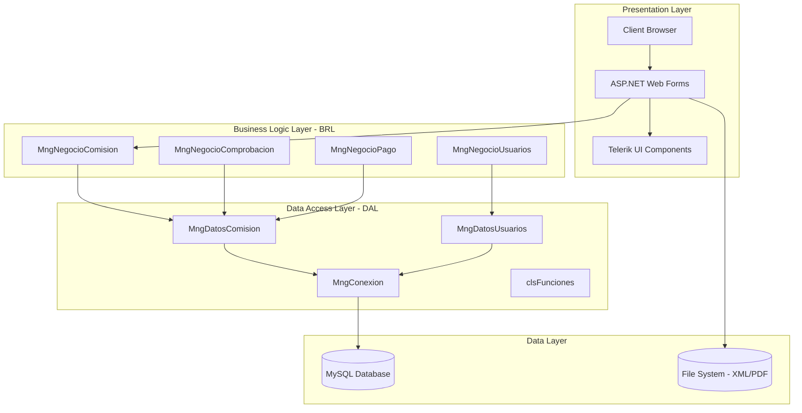
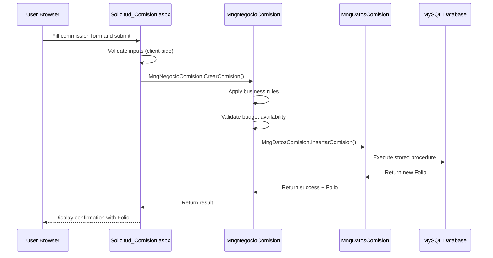
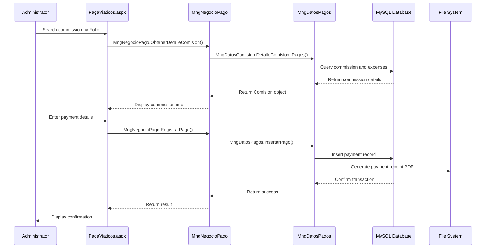

## Architecture Overview

SMAF follows a classic **three-tier architecture** pattern that separates concerns into distinct layers, promoting maintainability, scalability, and clear separation of responsibilities.



## Three-Tier Architecture

### 1. Presentation Layer (InapescaWeb)

The presentation layer is built with **ASP.NET Web Forms** and handles all user interface and interaction logic.

#### Key Components

<CardGroup cols={2}>
  <Card title="Web Forms (.aspx)" icon="window">
    ASPX pages for user interaction including Solicitudes, Autorizaciones, Comprobaciones, and Pagos
  </Card>
  
  <Card title="Code-Behind (.aspx.cs)" icon="code">
    C# code-behind files containing page-level business logic and event handlers
  </Card>
  
  <Card title="Telerik Controls" icon="palette">
    Rich UI components including RadGrid, RadCalendar, RadUpload, and RadTreeView
  </Card>
  
  <Card title="Master Pages" icon="layer-group">
    Consistent layout and navigation across the application
  </Card>
</CardGroup>

#### Directory Structure

```text
InapescaWeb/
├── Solicitudes/          # Commission request forms
│   ├── Solicitud_Comision.aspx
│   └── SolicitudPSP.aspx
├── Autorizaciones/       # Authorization workflows
│   └── Comision_Aut.aspx
├── Comprobaciones/       # Expense verification
│   ├── Comision_Comprobacion.aspx
│   └── Comprobacion2017.aspx
├── Pagos/                # Payment processing
│   └── PagaViaticos.aspx
├── Reportes/             # Report generation
├── Catalogos/            # Master data catalogs
├── Styles/               # CSS stylesheets
├── Resources/            # Static resources
└── web.config            # Configuration
```

#### Web Configuration

<CodeGroup>
```xml web.config - Framework Configuration
<?xml version="1.0"?>
<configuration>
  <system.web>
    <httpRuntime maxRequestLength="50000" />
    <compilation debug="true" targetFramework="4.0">
      <assemblies>
        <add assembly="System.Design, Version=4.0.0.0" />
        <add assembly="System.Web.Extensions, Version=4.0.0.0" />
        <add assembly="System.Windows.Forms, Version=4.0.0.0" />
      </assemblies>
    </compilation>
    
    <pages>
      <controls>
        <add tagPrefix="telerik" 
             namespace="Telerik.Web.UI" 
             assembly="Telerik.Web.UI" />
      </controls>
    </pages>
    
    <httpHandlers>
      <add path="Telerik.Web.UI.WebResource.axd" 
           type="Telerik.Web.UI.WebResource" 
           verb="*" 
           validate="false" />
      <add path="ChartImage.axd" 
           type="Telerik.Web.UI.ChartHttpHandler" 
           verb="*" 
           validate="false" />
    </httpHandlers>
  </system.web>
</configuration>
```

```xml web.config - Database Connection (Encrypted)
<appSettings>
  <!-- Encrypted connection strings for security -->
  <add key="localhost" 
       value="tGf1BXWYdXKSsk+PoraCYtfZx2CaCz+YSH7fEzln+tPCCIPyhXka5KxFVkYaJDYXUGY8BwEgL2KIww23CpBtBw==" />
  <add key="localhost_dgaipp" 
       value="tGf1BXWYdXKSsk+PoraCYvUxO9Yfr80kpFMxpZN60zKA15b9S5UHaufvII8GtSL31z1MDYDQY1WfatINvt6oeA==" />
  
  <!-- Telerik CDN Configuration -->
  <add key="Telerik.ScriptManager.TelerikCdn" value="Enabled" />
  <add key="Telerik.StyleSheetManager.TelerikCdn" value="Enabled" />
</appSettings>
```
</CodeGroup>

<Note>
Connection strings are encrypted using custom encryption (MngEncriptacion) for security. The system supports multiple database connections for different modules (SMAF, DGAIPP, Contratos).
</Note>

#### Example Page Implementation

<CodeGroup>
```csharp Page Load - Solicitud_Comision.aspx.cs
protected void Page_Load(object sender, EventArgs e)
{
    if (!clsFuncionesGral.IsSessionTimedOut())
    {
        if (!IsPostBack)
        {
            // Load navigation menu based on user role
            clsFuncionesGral.LlenarTreeViews(
                dictionary.NUMERO_CERO, 
                tvMenu, 
                false, 
                "Menu", 
                "SMAF", 
                Session["Crip_Rol"].ToString()
            );
            
            Carga_Valores();
            CrearTabla();
        }
    }
    else
    {
        Response.Redirect("../Index.aspx", true);
    }
}
```

```csharp Role-Based UI Logic
if ((Session["Crip_Rol"].ToString() == "ADMGR") || 
    (Session["Crip_Rol"].ToString() == dictionary.ADMINISTRADOR_INAPESCA) || 
    (Session["Crip_Rol"].ToString() == dictionary.DIRECTOR_GRAL))
{
    // Enable project selection for administrators
    clsFuncionesGral.Activa_Paneles(pnlproyectos, true);
    dplDep.DataSource = MngNegocioAdscripcion.ObtieneAdscripcion();
    dplDep.DataTextField = "Descripcion";
    dplDep.DataValueField = "Codigo";
    dplDep.DataBind();
}
else
{
    // Load user-specific projects only
    List<Entidad> List = MngNegocioProyecto.ObtieneProyectos(
        Session["Crip_Usuario"].ToString(), 
        Session["Crip_Rol"].ToString(), 
        Session["Crip_Ubicacion"].ToString()
    );
    dplProyectos.DataSource = List;
    dplProyectos.DataBind();
}
```
</CodeGroup>

### 2. Business Logic Layer (InapescaWeb.BRL)

The Business Logic Layer encapsulates all business rules, validation, and coordination between the presentation and data access layers.

#### Key Manager Classes

```text
InapescaWeb.BRL/
├── MngNegocioComision.cs          # Commission business logic
├── MngNegocioComprobacion.cs      # Expense verification logic
├── MngNegocioPago.cs              # Payment processing
├── MngNegocioUsuarios.cs          # User management
├── MngNegocioProyecto.cs          # Project management
├── MngNegocioMinistracion.cs      # Advance payment logic
├── MngNegocioTransparencia.cs     # Transparency reporting
└── MngNegocioPermisos.cs          # Permission management
```

#### Business Logic Examples

<CodeGroup>
```csharp MngNegocioComision.cs - Commission Operations
namespace InapescaWeb.BRL
{
    public class MngNegocioComision
    {
        // Insert expense report with fiscal validation
        public static Boolean Inserta_Comprobacion_Comision(
            string psOficio, 
            string psClvOficio, 
            string psComisionado, 
            string psUbicacionComisionado, 
            string psFechaFactura, 
            string psProyecto, 
            string psUbicacionProyecto, 
            string psTipoComprobacion, 
            string psClvConcepto, 
            string psDescripcionConcepto, 
            string psPdf, 
            string psImporte, 
            string psXml, 
            string psMetPago, 
            string psMetPagoUsser, 
            string psObservaciones, 
            string psDocumento, 
            string psTicket, 
            string psUUID, 
            string psPeriodo, 
            string psVersion = ""
        )
        {
            return MngDatosComision.Inserta_Comprobacion_Comision(
                psOficio, psClvOficio, psComisionado, 
                psUbicacionComisionado, psFechaFactura, psProyecto, 
                psUbicacionProyecto, psTipoComprobacion, psClvConcepto, 
                psDescripcionConcepto, psPdf, psImporte, psXml, 
                psMetPago, psMetPagoUsser, psObservaciones, 
                psDocumento, psTicket, psUUID, psPeriodo, psVersion
            );
        }
        
        // Retrieve commissions for transparency
        public static List<Comision> Lista_ComisionesTransparencia(
            string psYear
        )
        {
            return MngDatosComision.Lista_ComisionesTransparencia(psYear);
        }
        
        // Check for overlapping commissions
        public static bool Comision_Extraordinaria(
            string psUsuario, 
            string psFechaInicio, 
            string psFechaFinal, 
            string psOpcion
        )
        {
            return MngDatosComision.Comision_Extraordinaria(
                psUsuario, psFechaInicio, psFechaFinal, psOpcion
            );
        }
        
        // Calculate accumulated travel days
        public static string Dias_Acumulados(
            string psComisionado,
            string psPeriodo
        )
        {
            return MngDatosComision.Dias_Acumulados(
                psComisionado, psPeriodo
            );
        }
    }
}
```

```csharp MngNegocioComprobacion.cs - Expense Validation
namespace InapescaWeb.BRL
{
    public class MngNegocioComprobacion
    {
        // Validate and update expense verification status
        public static bool Update_Estatus_Comprobacion(
            string psOficio, 
            string psComisionado, 
            string psUbicacion, 
            string psFecha, 
            string psImporte, 
            string psDocumento,
            string psOpcion
        )
        {
            return MngDatosComision.Update_Estatus_Comprobacion(
                psOficio, psComisionado, psUbicacion, 
                psFecha, psImporte, psDocumento, psOpcion
            );
        }
        
        // List fiscal receipts (XML/PDF)
        public static List<Entidad> Lista_ComprobantesFiscales(
            string psOficio, 
            string psComisionado, 
            string psUbicacionComisionado, 
            string psProyecto, 
            string psUbicacionproyecto, 
            string psarchivo
        )
        {
            return MngDatosComision.Lista_ComprobantesFiscales(
                psOficio, psComisionado, psUbicacionComisionado, 
                psProyecto, psUbicacionproyecto, psarchivo
            );
        }
    }
}
```
</CodeGroup>

<Warning>
The BRL layer should **never** directly access the database. All data operations must go through the DAL layer to maintain proper separation of concerns.
</Warning>

### 3. Data Access Layer (InapescaWeb.DAL)

The Data Access Layer handles all database interactions and data persistence logic.

#### Key Data Manager Classes

```text
InapescaWeb.DAL/
├── MngConexion.cs                 # Database connection management
├── MngDatosComision.cs            # Commission data operations
├── MngDatosUsuarios.cs            # User data operations
├── MngDatosComprobacion.cs        # Expense data operations
├── MngDatosPagos.cs               # Payment data operations
├── MngDatosProyecto.cs            # Project data operations
├── MngEncriptacion.cs             # Encryption utilities
└── clsFunciones.cs                # Common data functions
```

#### Database Connection Management

<CodeGroup>
```csharp MngConexion.cs - MySQL Connection Handler
using MySql.Data.MySqlClient;
using System.Configuration;
using System.Data;

namespace InapescaWeb.DAL
{
    public class MngConexion
    {
        public static MySqlConnection ConexionMysql;
        
        // Get main SMAF database connection
        public static MySqlConnection getConexionMysql()
        {
            string CadenaConexionEncriptada = 
                ConfigurationManager.AppSettings["localhost"];
            
            string CadenaConexion = 
                MngEncriptacion.decripString(CadenaConexionEncriptada);
            
            ConexionMysql = new MySqlConnection(CadenaConexion);
            return ConexionMysql;
        }
        
        // Get DGAIPP module connection
        public static MySqlConnection getConexionMysql_dgaipp()
        {
            string CadenaConexionEncriptada = 
                ConfigurationManager.AppSettings["localhost_dgaipp"];
            
            string CadenaConexion = 
                MngEncriptacion.decripString(CadenaConexionEncriptada);
            
            ConexionMysql1 = new MySqlConnection(CadenaConexion);
            return ConexionMysql1;
        }
        
        // Dispose connection properly
        public static void disposeConexion()
        {
            ConexionMysql.Close();
            ConexionMysql.Dispose();
        }
    }
}
```

```csharp Example DAL Method Pattern
public static List<Comision> ObtieneListaComisiones(
    string psPeriodo, 
    string psUsuario
)
{
    List<Comision> listaComisiones = new List<Comision>();
    MySqlConnection conn = null;
    MySqlCommand cmd = null;
    MySqlDataReader reader = null;
    
    try
    {
        conn = MngConexion.getConexionMysql();
        conn.Open();
        
        cmd = new MySqlCommand("sp_obtiene_comisiones", conn);
        cmd.CommandType = CommandType.StoredProcedure;
        cmd.Parameters.AddWithValue("@periodo", psPeriodo);
        cmd.Parameters.AddWithValue("@usuario", psUsuario);
        
        reader = cmd.ExecuteReader();
        
        while (reader.Read())
        {
            Comision comision = new Comision();
            comision.Folio = reader["folio"].ToString();
            comision.Fecha_Solicitud = reader["fecha_sol"].ToString();
            comision.Proyecto = reader["proyecto"].ToString();
            // ... map all fields
            listaComisiones.Add(comision);
        }
    }
    finally
    {
        if (reader != null) reader.Close();
        if (cmd != null) cmd.Dispose();
        if (conn != null) MngConexion.disposeConexion();
    }
    
    return listaComisiones;
}
```
</CodeGroup>

## Entity Layer (InapescaWeb.Entidades)

Domain entities represent business objects and data structures.

### Core Entities

<CardGroup cols={2}>
  <Card title="Usuario" icon="user">
    User information including credentials, role, location, and personal data
  </Card>
  
  <Card title="Comision" icon="briefcase">
    Travel commission with all details: dates, destination, budget, approvals
  </Card>
  
  <Card title="comprobacion" icon="receipt">
    Expense verification records with receipts and amounts
  </Card>
  
  <Card title="Pagos" icon="credit-card">
    Payment records with bank details and transaction information
  </Card>
</CardGroup>

<CodeGroup>
```csharp Usuario.cs - User Entity
namespace InapescaWeb.Entidades
{
    public class Usuario
    {
        // Authentication
        public string Usser { get; set; }
        public string Password { get; set; }
        public string Rol { get; set; }
        public string Nivel { get; set; }
        
        // Personal Information
        public string Nombre { get; set; }
        public string ApPat { get; set; }
        public string ApMat { get; set; }
        public string RFC { get; set; }
        public string CURP { get; set; }
        public string Email { get; set; }
        
        // Organizational
        public string Secretaria { get; set; }
        public string Organismo { get; set; }
        public string Ubicacion { get; set; }
        public string Area { get; set; }
        public string Puesto { get; set; }
        public string Cargo { get; set; }
        
        // Address
        public string calle { get; set; }
        public string numext { get; set; }
        public string num_int { get; set; }
        public string colonia { get; set; }
        public string delegacion { get; set; }
        public string Estado { get; set; }
    }
}
```

```csharp Comision.cs - Commission Entity (Excerpt)
namespace InapescaWeb.Entidades
{
    public class Comision
    {
        // Identification
        public string Folio { get; set; }
        public string Oficio { get; set; }
        public string Estatus { get; set; }
        
        // Dates and Workflow
        public string Fecha_Solicitud { get; set; }
        public string Fecha_Responsable { get; set; }
        public string Fecha_Vobo { get; set; }
        public string Fecha_Autoriza { get; set; }
        
        // Participants
        public string Usuario_Solicita { get; set; }
        public string Comisionado { get; set; }
        public string Responsable_proyecto { get; set; }
        public string Vobo { get; set; }
        public string Autoriza { get; set; }
        
        // Travel Details
        public string Lugar { get; set; }
        public string Fecha_Inicio { get; set; }
        public string Fecha_Final { get; set; }
        public string Objetivo { get; set; }
        public string Tipo_Comision { get; set; }
        
        // Budget
        public string Proyecto { get; set; }
        public string Partida_Presupuestal { get; set; }
        public string Total_Viaticos { get; set; }
        public string Combustible_Solicitado { get; set; }
        public string Peaje { get; set; }
        public string Pasaje { get; set; }
        
        // Transportation
        public string Clase_Trans { get; set; }
        public string Tipo_Trans { get; set; }
        public string Vehiculo_Solicitado { get; set; }
    }
}
```
</CodeGroup>

## Technology Stack

<CardGroup cols={3}>
  <Card title="ASP.NET 4.0" icon="microsoft">
    Web application framework with Web Forms
  </Card>
  
  <Card title="C# .NET" icon="code">
    Primary programming language
  </Card>
  
  <Card title="MySQL" icon="database">
    Relational database for data persistence
  </Card>
  
  <Card title="Telerik UI" icon="palette">
    Rich web UI component suite
  </Card>
  
  <Card title="IIS" icon="server">
    Web server for hosting
  </Card>
  
  <Card title="Visual Studio" icon="laptop-code">
    Development environment
  </Card>
</CardGroup>

### Key Technologies

| Component | Technology | Purpose |
|-----------|-----------|---------|
| **Web Framework** | ASP.NET Web Forms 4.0 | Server-side web application framework |
| **Language** | C# | Business logic and data access |
| **Database** | MySQL | Data persistence and storage |
| **ORM/Data Access** | MySql.Data.MySqlClient | Database connectivity |
| **UI Components** | Telerik RadControls | Rich UI widgets (Grid, Calendar, Upload, etc.) |
| **Reporting** | Microsoft ReportViewer | PDF report generation |
| **Document Processing** | XML/PDF parsing | Fiscal receipt validation (CFDI) |
| **Encryption** | Custom (MngEncriptacion) | Connection string and password encryption |

## Component Interaction Flow

### Example: Creating a Commission Request



### Example: Processing Payment



## Security Architecture

### Authentication & Authorization

<CodeGroup>
```csharp Login Process (Index.aspx.cs)
protected void btnAceptar_Click(object sender, EventArgs e)
{
    // Input validation with regex
    if (!clsFuncionesGral.Exp_Regular(txtUsuario.Text))
    {
        if (!clsFuncionesGral.Exp_Regular(txtPassword.Text))
        {
            Entidades.Login objLogin = new Entidades.Login();
            
            // Encrypt credentials before transmission
            objLogin.Usuario = MngEncriptacion.encryptString(
                clsFuncionesGral.ConvertMayus(txtUsuario.Text)
            );
            objLogin.Password = MngEncriptacion.encryptString(
                clsFuncionesGral.ConvertMayus(txtPassword.Text)
            );
            
            Valida_Session(objLogin);
        }
    }
}

public void Valida_Session(Entidades.Login objLogin)
{
    Entidades.Usuario oUsuario = MngNegocioLogin.Acceso_Smaf(
        objLogin.Ubicacion, 
        objLogin.Usuario, 
        objLogin.Password
    );
    
    if (!oUsuario.Usser.Equals("0"))
    {
        // Create secure session
        Session.Timeout = 30;
        Session["Crip_Usuario"] = oUsuario.Usser;
        Session["Crip_Rol"] = oUsuario.Rol;
        Session["Crip_Ubicacion"] = oUsuario.Ubicacion;
        // ... store user context
        
        Response.Redirect("Home/Home.aspx", true);
    }
}
```

```csharp Session Validation
if (!clsFuncionesGral.IsSessionTimedOut())
{
    // Process request
    string lsSession = Session["Crip_Rol"].ToString();
    
    if ((lsSession != Dictionary.INVESTIGADOR) && 
        (lsSession != Dictionary.ENLACE))
    {
        // User has permission
        Carga_Valores();
    }
    else
    {
        ClientScript.RegisterStartupScript(
            this.GetType(), 
            "Inapesca", 
            "alert('No cuenta con los permisos necesarios.');", 
            true
        );
        Response.Redirect("../Home/Home.aspx", true);
    }
}
else
{
    Response.Redirect("../Index.aspx", true);
}
```
</CodeGroup>

### Security Features

- **Encrypted connection strings** using custom encryption
- **SQL injection prevention** via parameterized queries
- **Input validation** with regular expressions
- **Session timeout** enforcement (30 minutes)
- **Role-based access control** throughout the application
- **X-Frame-Options header** to prevent clickjacking
- **File upload restrictions** (50MB max, validation)

## Project Structure

The complete solution structure in Visual Studio:

```text
InapescaWeb.sln
├── InapescaWeb (Web Application)
│   ├── Presentation layer (.aspx pages)
│   ├── Code-behind files (.aspx.cs)
│   └── Configuration (web.config)
├── InapescaWeb.BRL (Class Library)
│   └── Business logic managers
├── InapescaWeb.DAL (Class Library)
│   └── Data access managers
└── InapescaWeb.Entidades (Class Library)
    └── Domain entities
```

<CodeGroup>
```xml InapescaWeb.sln
Microsoft Visual Studio Solution File, Format Version 11.00
# Visual Studio 2010
Project("{FAE04EC0-301F-11D3-BF4B-00C04F79EFBC}") = "InapescaWeb", 
  "InapescaWeb\InapescaWeb.csproj", "{090B5AA3-82FB-4607-BEE8-38EBDA114B4E}"
EndProject
Project("{FAE04EC0-301F-11D3-BF4B-00C04F79EFBC}") = "InapescaWeb.Entidades", 
  "InapescaWeb.Entidades\InapescaWeb.Entidades.csproj", 
  "{6B711C7C-3272-43FC-BB0C-A99E644DF90B}"
EndProject
Project("{FAE04EC0-301F-11D3-BF4B-00C04F79EFBC}") = "InapescaWeb.BRL", 
  "InapescaWeb.BRL\InapescaWeb.BRL.csproj", "{9E452915-86A4-4499-B7C6-EDB42B6FF5EE}"
EndProject
Project("{FAE04EC0-301F-11D3-BF4B-00C04F79EFBC}") = "InapescaWeb.DAL", 
  "InapescaWeb.DAL\InapescaWeb.DAL.csproj", "{1211AE21-A6A2-42F4-A400-BCC288C0D4A9}"
EndProject
```
</CodeGroup>

## Database Architecture

SMAF uses **MySQL** as its relational database with the following characteristics:

### Database Structure

- **Stored Procedures**: Business logic encapsulated in database
- **Multiple Databases**: Separate databases for SMAF, DGAIPP, and Contratos modules
- **Encrypted Connections**: All connection strings encrypted in configuration

### Key Database Operations

```csharp
// Example stored procedure call
cmd = new MySqlCommand("sp_obtiene_comisiones", conn);
cmd.CommandType = CommandType.StoredProcedure;
cmd.Parameters.AddWithValue("@periodo", psPeriodo);
cmd.Parameters.AddWithValue("@usuario", psUsuario);
```

## File System Integration

SMAF stores documents in the file system:

- **XML files**: CFDI fiscal receipts (v3.3, v4.0)
- **PDF files**: Receipt PDFs, reports, official documents
- **Upload directories**: Organized by year, project, and commission

## Performance Considerations

<CardGroup cols={2}>
  <Card title="Connection Pooling" icon="plug">
    MySQL connection pooling for efficient database access
  </Card>
  
  <Card title="Telerik CDN" icon="cloud">
    UI components served from CDN to reduce server load
  </Card>
  
  <Card title="Session State" icon="memory">
    In-memory session management with 30-minute timeout
  </Card>
  
  <Card title="File Streaming" icon="file-arrow-down">
    Large files served via streaming to minimize memory usage
  </Card>
</CardGroup>

## Next Steps

<CardGroup cols={2}>
  <Card title="Development Guide" icon="hammer" href="/development">
    Set up your development environment and build the project
  </Card>
  
  <Card title="API Reference" icon="code" href="/api-reference">
    Detailed API documentation for all layers
  </Card>
  
  <Card title="Database Schema" icon="database" href="/database">
    Complete database schema and stored procedures
  </Card>
  
  <Card title="Deployment" icon="rocket" href="/deployment">
    Deploy SMAF to IIS production environment
  </Card>
</CardGroup>
