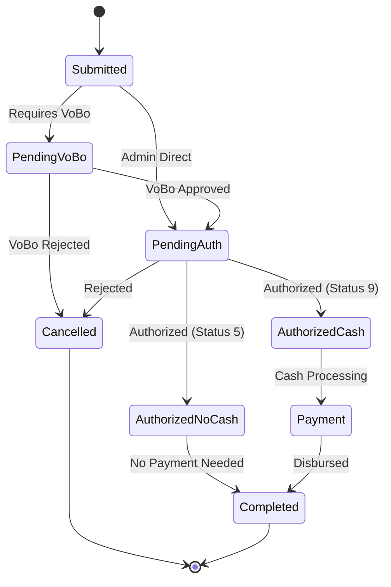

## Workflow Overview

The SMAF authorization workflow is a multi-stage process that ensures proper review and approval of travel and expense requests. The system tracks each commission through various status states and notifies relevant parties at each stage.

<Note>
The workflow varies based on the requester's role, administrative unit, and whether they have local administrator privileges.
</Note>

## Workflow Stages

<Steps>
  <Step title="Request Submission">
    The employee or their representative submits a commission request through the SMAF system.

    **Initial Status:** Submitted (pending review)
    
    **Actions Performed:**
    - System generates unique folio number
    - Automatically assigns VoBo and Authorizer based on organizational hierarchy
    - Validates requester eligibility
    - Creates commission record in database
    
    <CodeGroup>
    ```csharp Request Creation
    // Source: Comision_Aut.aspx.cs:405-406 (simplified)
    MngNegocioComision.Inserta_Comision(
        "CRIPSC01",                                  // Office type
        "01",                                        // Commission type
        Session["Crip_Folio"].ToString(),           // Folio number
        Dictionary.NUMERO_CERO,                      // Office number
        clsFuncionesGral.FormatFecha(lsHoy),        // Request date
        Dictionary.FECHA_NULA,                       // Response date (null)
        detalleComision.Fecha_Vobo,                 // VoBo date
        clsFuncionesGral.FormatFecha(lsHoy),        // Authorization date
        detalleComision.Usuario_Solicita,           // Requesting user
        detalleComision.Ubicacion,                  // Department
        detalleComision.Area,                        // Area
        detalleComision.Proyecto,                    // Project
        // ... additional parameters
        Vobo_Aut[0],                                 // VoBo approver
        Vobo_Aut[1],                                 // Authorizer
        objUsuario.Usser,                            // Traveler
        objUsuario.Ubicacion,                        // Traveler location
        lsEstatus,                                   // Status: "1" or "8"
        // ... observations and other fields
    );
    ```
    </CodeGroup>

    **Status Code:** `1` (Pending Authorization) or `8` (Pending VoBo)
  </Step>

  <Step title="VoBo Review (Visto Bueno)">
    The designated VoBo reviewer examines the request and can approve, modify, or reject it.

    **Status:** `8` (Pending VoBo)
    
    **VoBo Actions Available:**
    - Review commission details (dates, destination, objective)
    - Modify authorized period if needed
    - Adjust days to be paid (including half-days)
    - Set payment zones (commercial/rural/mixed)
    - Configure per diem types and payment methods
    - Approve transportation and fuel allowances
    - Add or remove travelers from multi-person commissions
    - Enter observations and comments
    
    <CodeGroup>
    ```csharp VoBo Data Loading
    // Source: Comision_Aut.aspx.cs:606-647
    protected void ImageButton2_Click(object sender, ImageClickEventArgs e)
    {
        string lsFolioAut = dplVobo.SelectedValue.ToString();
        
        if ((lsFolioAut == null) | (lsFolioAut == Dictionary.CADENA_NULA))
        {
            ClientScript.RegisterStartupScript(this.GetType(), "Inapesca", 
                "alert('Debe seleccionar una solicitud para ministrar');", true);
            return;
        }
        else
        {
            clsFuncionesGral.Activa_Paneles(pnlDetalle, true);
            string[] lsCadena = lsFolioAut.Split(new Char[] { '|' });
            string lsFoliA = lsCadena[0];
            string lsUbicacionA = lsCadena[1];
            
            Session["Crip_Folio"] = lsFoliA;
            Session["Crip_Opcion"] = Dictionary.VOBO;
            Session["Crip_UbicacionAut"] = lsUbicacionA;
            
            // Load commission details for VoBo review
            Carga_Panel(lsFoliA, lsUbicacionA, Dictionary.VOBO, 
                MngNegocioPermisos.ObtienePermisos(
                    Session["Crip_Usuario"].ToString(), 
                    Dictionary.PERMISO_ADMINISTRADOR_LOCAL));
        }
    }
    ```
    </CodeGroup>

    **Possible Outcomes:**
    - **Approved:** Moves to Status `1` (Pending Final Authorization)
    - **Rejected:** Moves to Status `0` (Cancelled)
    - **Modified:** Updates commission details and moves to Status `1`
  </Step>

  <Step title="Authorization Review">
    After VoBo approval, the authorizer performs final review and authorization.

    **Status:** `1` (Pending Authorization)
    
    **Authorizer Actions Available:**
    - Review all VoBo-approved details (read-only for most fields)
    - Add final observations
    - Generate official authorization documents
    - Approve or reject the commission
    
    <CodeGroup>
    ```csharp Authorization Data Loading
    // Source: Comision_Aut.aspx.cs:580-604
    protected void ImageButton1_Click(object sender, ImageClickEventArgs e)
    {
        string lsFolioAut = dplAutoriza.SelectedValue.ToString();
        
        if ((lsFolioAut == null) | (lsFolioAut == Dictionary.CADENA_NULA))
        {
            ClientScript.RegisterStartupScript(this.GetType(), "Inapesca", 
                "alert('Debe seleccionar una solicitud para autorizar');", true);
            return;
        }
        else
        {
            clsFuncionesGral.Activa_Paneles(pnlDetalle, true);
            string[] lsCadena = lsFolioAut.Split(new Char[] { '|' });
            string lsFoliA = lsCadena[0];
            string lsUbicacionA = lsCadena[1];
            
            Session["Crip_Folio"] = lsFoliA;
            Session["Crip_Opcion"] = Dictionary.AUTORIZA;
            Session["Crip_UbicacionAut"] = lsUbicacionA;
            
            // Load commission details for authorization
            Carga_Panel(lsFoliA, lsUbicacionA, Dictionary.AUTORIZA, 
                MngNegocioPermisos.ObtienePermisos(
                    Session["Crip_Usuario"].ToString(), 
                    Dictionary.PERMISO_ADMINISTRADOR_LOCAL));
        }
    }
    ```
    </CodeGroup>

    **Field Access Control:**
    - Most fields are read-only (set by VoBo)
    - Only observations field is editable
    - Cannot add/remove travelers
    - Cannot modify dates or allowances
    
    **Possible Outcomes:**
    - **Authorized (No Cash):** Status `5` - No cash disbursements required
    - **Authorized (With Cash):** Status `9` - Includes cash components (fuel, tolls, etc.)
    - **Rejected:** Status `0` - Cancelled with observations
  </Step>

  <Step title="Document Generation">
    Upon authorization, the system automatically generates official documents.

    **Documents Created:**
    - Official commission authorization letter
    - Travel order (oficio)
    - Payment authorization forms
    - PDF records for archival
    
    <CodeGroup>
    ```csharp Document Generation
    // Source: Comision_Aut.aspx.cs:3665
    clsPdf.Genera_Oficio_Comision(
        objComision,                                     // Commission object
        oUbicacion,                                      // Location details
        objProyecto,                                     // Project information
        clsFuncionesGral.ConvertMayus(
            Session["Crip_Abreviatura"].ToString() + "  " + 
            Session["Crip_Nombre"].ToString() + "  " + 
            Session["Crip_ApPat"].ToString() + "  " + 
            Session["Crip_ApMat"].ToString()),          // Authorizer name
        Session["Crip_Cargo"].ToString(),               // Position
        true                                             // Generate flag
    );
    ```
    </CodeGroup>

    **File Locations:**
    - PDFs stored in server file system
    - Database stores file paths and metadata
    - Links available in commission detail view
  </Step>

  <Step title="Payment Processing">
    Authorized commissions move to the payment/disbursement stage.

    **Status:** `5` or `9` (Authorized)
    
    **Payment Components:**
    - Per diem allowances (viaticos)
    - Fuel reimbursement or vouchers
    - Toll fees (peaje)
    - Transportation/airfare (pasajes)
    
    **Payment Methods:**
    - Direct deposit to bank account
    - Check issuance
    - Fuel vouchers
    - Mixed payment (combination of above)
    
    <Warning>
    Commissions with Status `5` require no cash disbursement. Status `9` indicates cash components that must be processed.
    </Warning>

    <CodeGroup>
    ```csharp Status Determination Logic
    // Source: Comision_Aut.aspx.cs:3649-3663
    bool autorizacion = MngNegocioComision.Update_Comision(
        objComision, 
        Session["Crip_Opcion"].ToString(), 
        Session["Crip_Folio"].ToString(), 
        Session["Crip_Usuario"].ToString(), 
        permisos, 
        true);

    // Determine final status based on payment components
    if ((objComision.Zona_Comercial == "0") & 
        ((objComision.Combustible_Efectivo == Dictionary.NUMERO_CERO) & 
         (objComision.Peaje == Dictionary.NUMERO_CERO) & 
         (objComision.Pasaje == Dictionary.NUMERO_CERO)))
    {
        objComision.Estatus = "5";  // No zone, no cash = Status 5
    }
    else if ((objComision.Zona_Comercial == "15") & 
             ((objComision.Combustible_Efectivo == Dictionary.NUMERO_CERO) & 
              (objComision.Peaje == Dictionary.NUMERO_CERO) & 
              (objComision.Pasaje == Dictionary.NUMERO_CERO)))
    {
        objComision.Estatus = "5";  // Zone 15, no cash = Status 5
    }
    else
    {
        objComision.Estatus = "9";  // Has cash components = Status 9
    }
    ```
    </CodeGroup>
  </Step>

  <Step title="Notification and Tracking">
    The system sends email notifications to relevant parties at each stage.

    **Notification Recipients:**
    - Requester (on approval/rejection)
    - VoBo reviewer (on new submission)
    - Authorizer (on VoBo approval)
    - Finance department (on final authorization)
    - System administrators (special cases)
    
    <CodeGroup>
    ```csharp Email Notification
    // Source: Comision_Aut.aspx.cs:3726-3747
    List<Entidad> ListaAutoriza = MngNegocioMail.Obtiene_Mail(
        "VoBo", 
        Convert.ToString(detalleComision.Folio), 
        Session["Crip_Ubicacion"].ToString());

    foreach (Entidad l in ListaAutoriza)
    {
        if (l.Codigo != "")
        {
            string TipoMail = "VOBO";
            Usuario usu = MngNegocioUsuarios.Obten_Datos(l.Codigo, true);
            
            bool envio_mail = clsMail.Mail_Comision(
                Session["Crip_Secretaria"].ToString(),
                Session["Crip_Organismo"].ToString(),
                Session["Crip_Ubicacion"].ToString(),
                objProyecto.Dependencia,
                usu.Email,                               // Recipient
                usu.Nombre,
                Session["Crip_Nombre"].ToString() + " " + 
                    Session["Crip_ApPat"].ToString(),   // Sender
                listaGrid,                               // Traveler list
                // ... commission details
                TipoMail,
                Session["Crip_Rol"].ToString(),
                Session["Crip_Cargo"].ToString(),
                MailBandera
            );
        }
    }
    ```
    </CodeGroup>

    **Tracking Information:**
    - Commission folio number
    - Current status
    - Approval/rejection dates
    - Comments and observations at each stage
    - Document generation timestamps
  </Step>
</Steps>

## Status Transitions

The following diagram illustrates the possible status transitions throughout the workflow:



### Status Code Reference

<ResponseField name="Status 0" type="Cancelled">
  Commission has been cancelled or rejected. Observations field contains rejection reason.
</ResponseField>

<ResponseField name="Status 1" type="Pending Authorization">
  Commission has passed VoBo review and awaits final authorization.
</ResponseField>

<ResponseField name="Status 5" type="Authorized (No Cash)">
  Commission is authorized but requires no cash disbursement. Common for commissions with only per diems in zones with no cash component.
</ResponseField>

<ResponseField name="Status 8" type="Pending VoBo">
  Commission awaits VoBo (Visto Bueno) approval from the designated reviewer.
</ResponseField>

<ResponseField name="Status 9" type="Authorized (With Cash)">
  Commission is fully authorized and includes cash components (fuel, tolls, transportation). Payment processing initiated.
</ResponseField>

## Approval/Rejection Actions

### Approving a Commission

When approving a commission, the reviewer or authorizer must:

1. **Review All Details**
   - Verify traveler information
   - Confirm dates and destination
   - Check budget availability
   - Validate project information

2. **Make Modifications (VoBo only)**
   - Adjust authorized period if needed
   - Modify days to be paid
   - Set appropriate payment zones
   - Configure per diem rates
   - Approve or adjust fuel/toll allowances

3. **Add Observations**
   - Document any changes made
   - Provide justification for modifications
   - Note special circumstances

4. **Submit Approval**
   - Click the "Autorizar" or "Ministrar" button
   - System validates all required fields
   - Status updates automatically
   - Notifications sent

<CodeGroup>
```csharp Approval Submission
// Source: Comision_Aut.aspx.cs:3703-3708
ClientScript.RegisterStartupScript(this.GetType(), "Inapesca", 
    "alert('Se ha autorizado/ministrado correctamente la solicitud de comision número :" + 
    Session["Crip_Folio"].ToString() + 
    " , para iniciar tramite de viaticos correspondiente');", 
    true);
    
Crear_Tabla(permisos);  // Refresh the authorization queue
pnlDetalle.Visible = false;
Destructor();
```
</CodeGroup>

### Rejecting a Commission

To reject a commission:

1. **Enter Rejection Reason**
   - Observations field is **required**
   - Must provide clear explanation
   - Document policy violations or missing information

2. **Cancel Commission**
   - Click "Cancelar Solicitud" button
   - System validates observations are provided
   - Status changes to `0` (Cancelled)

<CodeGroup>
```csharp Commission Cancellation
// Source: Comision_Aut.aspx.cs:3768-3783
protected void btnCancelar_Click(object sender, EventArgs e)
{
    if ((txtObservaciones.Text == "") | (txtObservaciones.Text == null))
    {
        ClientScript.RegisterStartupScript(this.GetType(), "Inapesca", 
            "alert('Debe anotar motivo de cancelacion de comision en campo observaciones');", 
            true);
        return;
    }
    else
    {
        MngNegocioComision.Update_estatus_Comision(
            "0",                                          // Status = Cancelled
            "", 
            Session["Crip_Folio"].ToString(), 
            Session["Crip_UbicacionAut"].ToString(), 
            "", 
            txtObservaciones.Text,                        // Cancellation reason
            true);
        
        pnlDetalle.Visible = false;
        Crear_Tabla(MngNegocioPermisos.ObtienePermisos(
            Session["Crip_Usuario"].ToString(), 
            Dictionary.PERMISO_ADMINISTRADOR_LOCAL));
    }
}
```
</CodeGroup>

<Warning>
Cancelled commissions cannot be reopened. A new request must be submitted if the commission is still needed.
</Warning>

## Comments and Observations

The system tracks observations at multiple stages:

### VoBo Observations

- Entered by VoBo reviewer
- Visible to authorizer and requester
- Used to document changes or special conditions
- Stored in `Observaciones_Vobo` field

<CodeGroup>
```csharp VoBo Observations Loading
// Source: Comision_Aut.aspx.cs:728-739
if ((detalleComision.Observaciones_Vobo == null) | 
    (detalleComision.Observaciones_Vobo == Dictionary.CADENA_NULA))
{
    txtObservaciones.Text = Dictionary.CADENA_NULA;
    txtObservaciones.BackColor = Color.Beige;  // Indicates editable
    txtObservaciones.Enabled = true;
}
else
{
    txtObservaciones.Text = detalleComision.Observaciones_Vobo;
    txtObservaciones.BackColor = Color.Empty;
    txtObservaciones.Enabled = false;  // Read-only once saved
}
```
</CodeGroup>

### Authorization Observations

- Entered by final authorizer
- Visible to all parties
- Documents final approval conditions
- Stored in `Observaciones_Autoriza` field

<CodeGroup>
```csharp Authorization Observations Display
// Source: Comision_Aut.aspx.cs:756-764
if (detalleComision.Observaciones_Autoriza != "")
{
    Label60.Text = detalleComision.Observaciones_Autoriza;
    clsFuncionesGral.Activa_Paneles(Panel1, true);  // Show observation panel
}
else
{
    clsFuncionesGral.Activa_Paneles(Panel1, false);  // Hide if empty
}
```
</CodeGroup>

### Request Observations

- Entered by requester during submission
- Provides context and justification
- Read-only during approval process
- Stored in `Observaciones_Solicitud` field

## Multi-Traveler Commissions

Commissions can include multiple travelers (comisionados). The workflow handles this through:

### Adding Travelers (VoBo Stage Only)

1. VoBo reviewer can add additional employees
2. System validates each traveler:
   - No pending commission reports
   - Annual day limits not exceeded
   - No conflicting travel dates
   - Special permissions if needed

<CodeGroup>
```csharp Add Traveler to Commission
// Source: Comision_Aut.aspx.cs:221-534 (simplified)
protected void dplComisionados_SelectedIndexChanged(object sender, EventArgs e)
{
    // Validation: Check if already added
    foreach (GridViewRow row in GridView1.Rows)
    {
        if (row.Cells[1].Text == dplComisionados.SelectedValue.ToString())
        {
            ClientScript.RegisterStartupScript(this.GetType(), "Inapesca", 
                "alert('El usuario ya se encuentra agregado para esta comision');", 
                true);
            return;
        }
    }
    
    // Validation: Check pending reports
    string ultimaFechaComision = MngNegocioComision.Obtiene_Max_Comision_Comprobar(
        dplComisionados.SelectedValue.ToString());
    
    // Validation: Check annual day limits
    double totalDias = clsFuncionesGral.Convert_Double(
        MngNegocioComision.Dias_Acumulados(
            dplComisionados.SelectedValue.ToString(), year));
    
    // If all validations pass, insert traveler
    MngNegocioComision.Inserta_Comision(/* ... parameters ... */);
    
    // Refresh traveler list
    Crea_ListaComisionados(Session["Crip_Folio"].ToString(), 
        Session["Crip_Opcion"].ToString(), 
        Session["Crip_Usuario"].ToString(), 
        lsEstatus, "", 
        Session["Crip_UbicacionAut"].ToString());
}
```
</CodeGroup>

### Removing Travelers

Local administrators and VoBo reviewers can remove travelers:

<CodeGroup>
```csharp Remove Traveler from Commission
// Source: Comision_Aut.aspx.cs:649-675
protected void GridView1_SelectedIndexChanged(object sender, EventArgs e)
{
    string CadenaELiminar = GridView1.Rows[
        Convert.ToInt32(GridView1.SelectedIndex.ToString())].Cells[1].Text.ToString();
    
    if (GridView1.Rows.Count > 1)
    {
        MngNegocioComision.Update_status(
            Session["Crip_Folio"].ToString(), 
            Session["Crip_UbicacionAut"].ToString(), 
            CadenaELiminar, 
            Session["Crip_Opcion"].ToString(), 
            clsFuncionesGral.ConvertMayus("baja por administrador"), 
            lsHoy);
        
        // Refresh traveler list
        if (Session["Crip_Opcion"].ToString() == Dictionary.AUTORIZA)
        {
            Crea_ListaComisionados(Session["Crip_Folio"].ToString(), 
                Session["Crip_Opcion"].ToString(), 
                Session["Crip_Usuario"].ToString(), 
                "1", "", 
                Session["Crip_UbicacionAut"].ToString());
        }
        else
        {
            Crea_ListaComisionados(Session["Crip_Folio"].ToString(), 
                Session["Crip_Opcion"].ToString(), 
                Session["Crip_Usuario"].ToString(), 
                "8", "", 
                Session["Crip_UbicacionAut"].ToString());
        }
    }
    else
    {
        ClientScript.RegisterStartupScript(this.GetType(), "Inapesca", 
            "alert('No puede eliminar todos los comisionados');", 
            true);
    }
}
```
</CodeGroup>

<Warning>
At least one traveler must remain on the commission. The last traveler cannot be removed.
</Warning>

## Best Practices

<AccordionGroup>
  <Accordion title="Timely Review">
    - Review pending authorizations within 2 business days
    - Process urgent requests immediately
    - Set up email notifications for new requests
    - Monitor authorization queue regularly
  </Accordion>

  <Accordion title="Thorough Documentation">
    - Always provide observations when rejecting
    - Document reasons for modifications
    - Note special circumstances or exceptions
    - Keep observations professional and concise
  </Accordion>

  <Accordion title="Validation Compliance">
    - Verify all system validations are satisfied
    - Check employee eligibility before approval
    - Ensure budget codes are correct
    - Confirm dates don't conflict with other commissions
  </Accordion>

  <Accordion title="Communication">
    - Coordinate with requesters on modifications
    - Notify finance department of urgent disbursements
    - Follow up on pending VoBo approvals
    - Escalate issues to administrators when needed
  </Accordion>
</AccordionGroup>

## Troubleshooting

<AccordionGroup>
  <Accordion title="Commission Not Appearing in Queue">
    **Possible Causes:**
    - You are not the assigned VoBo/Authorizer
    - Commission is in wrong status for your role
    - Filter settings excluding the commission
    - Commission was cancelled
    
    **Solutions:**
    - Verify your role assignment
    - Check commission status
    - Clear filters
    - Contact system administrator
  </Accordion>

  <Accordion title="Cannot Modify Fields">
    **Possible Causes:**
    - You are in Authorization stage (fields locked after VoBo)
    - You lack VoBo or administrator permissions
    - Commission is already authorized
    
    **Solutions:**
    - Verify your current stage (VoBo vs. Authorization)
    - Check your user permissions
    - Request VoBo reviewer to make changes
    - Cancel and resubmit if necessary
  </Accordion>

  <Accordion title="Employee Cannot Be Added to Commission">
    **Possible Causes:**
    - Employee has pending commission reports
    - Annual day limit exceeded
    - Conflicting travel dates
    - Employee already on commission
    
    **Solutions:**
    - Ask employee to submit pending reports
    - Request special permission (VIAT or OFMAY)
    - Verify no date conflicts
    - Check traveler list for duplicates
  </Accordion>

  <Accordion title="Authorization Button Disabled">
    **Possible Causes:**
    - Required fields are empty
    - Validation errors present
    - Missing budget information
    - System detected policy violation
    
    **Solutions:**
    - Review all required fields (marked in red)
    - Check validation error messages
    - Verify budget codes are assigned
    - Review system validations
  </Accordion>
</AccordionGroup>

## Related Documentation

<CardGroup cols={2}>
  <Card title="Authorization Overview" icon="shield-check" href="/autorizaciones/overview">
    Learn about authorization levels and role responsibilities
  </Card>
  <Card title="Commission Requests" icon="file-invoice" href="/solicitudes/overview">
    Create and submit commission requests
  </Card>
</CardGroup>