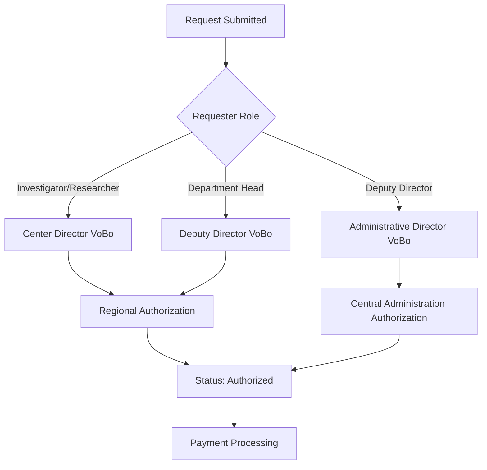

## Introduction

The SMAF authorization system manages the approval workflow for travel allowance and expense requests within the Mexican Federal Public Administration. The system implements a multi-level authorization process to ensure proper oversight and financial control.

<Note>
The authorization system is designed to comply with federal regulations governing travel expenses and allowances for public servants.
</Note>

## Authorization Levels

The SMAF system implements a three-tier authorization hierarchy:

### 1. VoBo (Visto Bueno - Approval)

The VoBo level represents the first authorization stage in the workflow.

**Key Responsibilities:**
- Review and validate travel request details
- Verify project information and budget allocation
- Approve or modify requested dates and allowances
- Add comments and observations
- Forward approved requests to the authorization stage

**Status Code:** `8`

**Workflow Actions:**
- Review commission details including dates, destination, and objective
- Validate authorized period and adjust days if necessary
- Set payment zones and per diem rates
- Approve transportation and fuel allowances
- Manage multi-traveler commissions

<CodeGroup>
```csharp VoBo Authorization Check
// Source: Comision_Aut.aspx.cs:686-750
if (psOpcion == Dictionary.AUTORIZA)
{
    detalleComision = MngNegocioComision.Detalle_Comision(psFolio, psUbicacion, "", "");
    btnAccion.Text = "AUTORIZAR";
    Label8.Text = clsFuncionesGral.ConvertMayus("Autorización de comisión número :  ") 
                  + detalleComision.Folio;
}
else // VOBO
{
    btnAccion.Text = " Ministrar ";
    detalleComision = MngNegocioComision.Detalle_Comision(psFolio, psUbicacion, "", "8");
    Label8.Text = clsFuncionesGral.ConvertMayus("Visto Bueno de comisión número :  ") 
                  + detalleComision.Folio;
}
```
</CodeGroup>

### 2. Approver (Autorizador - Authorization)

The Approver level handles the final authorization before financial disbursement.

**Key Responsibilities:**
- Final review of VoBo-approved requests
- Authorize budget items and payment methods
- Generate official authorization documents
- Update commission status to approved
- Initiate payment processing workflow

**Status Codes:** 
- `1` - Pending Authorization
- `5` - Authorized (no cash disbursements)
- `9` - Authorized (with cash disbursements)

**Special Capabilities:**
- Modify authorized periods
- Adjust fuel and toll allowances
- Assign vehicles and transportation
- Process international travel rates
- Handle mixed per diem types (rural/commercial)

<CodeGroup>
```csharp Authorization Status Logic
// Source: Comision_Aut.aspx.cs:3649-3663
if ((objComision.Zona_Comercial == "0") & 
    ((objComision.Combustible_Efectivo == Dictionary.NUMERO_CERO) & 
     (objComision.Peaje == Dictionary.NUMERO_CERO) & 
     (objComision.Pasaje == Dictionary.NUMERO_CERO)))
{
    objComision.Estatus = "5"; // Authorized without cash disbursement
}
else if ((objComision.Zona_Comercial == "15") & 
         ((objComision.Combustible_Efectivo == Dictionary.NUMERO_CERO) & 
          (objComision.Peaje == Dictionary.NUMERO_CERO) & 
          (objComision.Pasaje == Dictionary.NUMERO_CERO)))
{
    objComision.Estatus = "5"; // Special zone without cash
}
else
{
    objComision.Estatus = "9"; // Authorized with cash disbursement
}
```
</CodeGroup>

### 3. Local Administrator (Administrador Local)

Local Administrators have elevated privileges combining both VoBo and Authorization capabilities.

**Special Permissions:**
- Can directly authorize without VoBo stage
- Bypass standard workflow for urgent requests
- Manage commission cancellations
- Access administrative configuration settings
- Process and ministrar (disburse) funds

**Permission Code:** `PERMISO_ADMINISTRADOR_LOCAL`

<CodeGroup>
```csharp Administrator Permission Check
// Source: Comision_Aut.aspx.cs:54-83
public void Crear_Tabla(string psPermisos)
{
    if (psPermisos == Dictionary.PERMISO_ADMINISTRADOR_LOCAL)
    {
        // Administrator can authorize directly
        clsFuncionesGral.Activa_Paneles(pnlAutoriza, true);
        dplAutoriza.DataSource = MngNegocioComision.Obtiene_Solicitudes(
            Dictionary.AUTORIZA, 
            Session["Crip_Usuario"].ToString(), 
            "1");
        
        // VoBo panel is hidden for administrators
        clsFuncionesGral.Activa_Paneles(pnlVobo, false);
    }
    else
    {
        // Regular users see both panels
        clsFuncionesGral.Activa_Paneles(pnlAutoriza, true);
        clsFuncionesGral.Activa_Paneles(pnlVobo, true);
    }
}
```
</CodeGroup>

## Role Responsibilities

### VoBo Reviewers

**Primary Functions:**
- Receive new commission requests (Status: Pending VoBo)
- Validate request completeness and accuracy
- Modify commission parameters if needed
- Add observations for the requestor
- Forward to authorization or reject

**Interface Capabilities:**
- Edit authorized periods
- Adjust days to be paid
- Set payment zones (commercial/rural)
- Configure per diem types (tariff-based or standardized)
- Manage transportation and fuel requests
- Add additional travelers to commissions

<Warning>
VoBo reviewers must ensure that authorized periods do not exceed the requested dates without proper justification.
</Warning>

### Authorizers

**Primary Functions:**
- Review VoBo-approved requests
- Final budget authorization
- Generate official commission documents
- Update status to authorized
- Cannot modify most fields (read-only after VoBo)

**Restrictions:**
- Cannot change authorized periods (set by VoBo)
- Cannot modify payment zones
- Cannot add/remove travelers
- Can only add final observations

<CodeGroup>
```csharp Field Restrictions by Role
// Source: Comision_Aut.aspx.cs:1163-1239
if ((psOpcion == Dictionary.VOBO) | 
    (psPermisosAdmin == Dictionary.PERMISO_ADMINISTRADOR_LOCAL))
{
    // VoBo or Admin: Full edit capabilities
    pnlPeriodoautorizado.Enabled = true;
    chkMedioDia.Enabled = true;
    dplZonas.Enabled = true;
    dplPagos.Enabled = true;
    pnlAgregaComisionados.Visible = true;
    GridView1.Enabled = true;
}
else // Authorizer only
{
    // Authorizer: Read-only mode
    pnlPeriodoautorizado.Enabled = false;
    chkMedioDia.Enabled = false;
    dplZonas.Enabled = false;
    dplPagos.Enabled = false;
    pnlAgregaComisionados.Visible = false;
    GridView1.Enabled = false;
}
```
</CodeGroup>

### Local Administrators

**Primary Functions:**
- All VoBo capabilities
- All Authorizer capabilities
- Direct authorization without VoBo stage
- Cancel/reject commissions at any stage
- Override system validations when justified

**Special Actions:**
- Delete travelers from multi-person commissions
- Modify vehicle assignments
- Process urgent requests
- Handle special permission cases

## Authorization Hierarchy

The system automatically determines the approval chain based on the requester's role and administrative unit:



<CodeGroup>
```csharp Hierarchical Approval Logic
// Source: Comision_Aut.aspx.cs:354-356
Usuario objUsuario = MngNegocioUsuarios.Obten_Datos(dplComisionados.SelectedValue.ToString(), true);
Vobo_Aut = clsFuncionesGral.Obtiene_Jerarquico(objUsuario);

// Vobo_Aut[0] = VoBo approver user
// Vobo_Aut[1] = Final authorizer user
```
</CodeGroup>

## System Validations

The authorization system enforces several business rules:

### Annual Day Limits

<Note>
Commissioned employees have annual limits on travel days according to federal regulations.
</Note>

<CodeGroup>
```csharp Annual Days Validation
// Source: Comision_Aut.aspx.cs:331-344
double totalDias = clsFuncionesGral.Convert_Double(
    MngNegocioComision.Dias_Acumulados(dplComisionados.SelectedValue.ToString(), year));

if (totalDias >= clsFuncionesGral.Convert_Double(
    clsFuncionesGral.Convert_Decimales(Dictionary.DIAS_ANUALES)))
{
    // Check for special permission from Official Mayor
    lsPermisosEspeciales = MngNegocioPermisos.ObtienePermisos(
        dplComisionados.SelectedValue.ToString(), "OFMAY");
    
    if (lsPermisosEspeciales != "OFMAY")
    {
        ClientScript.RegisterStartupScript(this.GetType(), "Inapesca", 
            "alert('Employee has exceeded annual travel days limit');", true);
        return;
    }
}
```
</CodeGroup>

### Pending Reports

<Warning>
Employees with pending commission reports cannot be added to new commissions unless they have special authorization.
</Warning>

<CodeGroup>
```csharp Pending Report Validation
// Source: Comision_Aut.aspx.cs:264-327
string ultimaFechaComision = MngNegocioComision.Obtiene_Max_Comision_Comprobar(
    dplComisionados.SelectedValue.ToString());

if (ultimaFechaComision != null)
{
    DateTime fechamasdiez = Convert.ToDateTime(ultimaFechaComision).AddDays(10);
    bool DIFERENCIA = (Convert.ToDateTime(lsHoy) > fechamasdiez);
    
    if (DIFERENCIA)
    {
        // Check for special VIAT permission
        if (lsPermisosEspecialesVIAT != "VIAT")
        {
            ClientScript.RegisterStartupScript(this.GetType(), "Inapesca", 
                "alert('Employee has pending commission report exceeding 10-day grace period');", 
                true);
            return;
        }
    }
}
```
</CodeGroup>

## Best Practices

<AccordionGroup>
  <Accordion title="For VoBo Reviewers">
    - Carefully review all request details before approval
    - Verify budget availability for the project
    - Ensure authorized dates align with project schedules
    - Add clear observations if modifications are made
    - Check employee eligibility (no pending reports)
  </Accordion>

  <Accordion title="For Authorizers">
    - Verify VoBo approval completeness
    - Confirm budget codes are correct
    - Review all observations from VoBo stage
    - Generate authorization documents promptly
    - Ensure payment method is properly configured
  </Accordion>

  <Accordion title="For Local Administrators">
    - Use direct authorization only when justified
    - Document reasons for workflow bypasses
    - Monitor pending authorizations regularly
    - Process cancellations with proper observations
    - Review special permission requests carefully
  </Accordion>
</AccordionGroup>

## Related Documentation

<CardGroup cols={2}>
  <Card title="Approval Workflow" icon="diagram-project" href="/autorizaciones/approval-workflow">
    Detailed workflow from submission to final authorization
  </Card>
  <Card title="Commission Requests" icon="file-invoice" href="/solicitudes/overview">
    Learn about creating and submitting commission requests
  </Card>
</CardGroup>