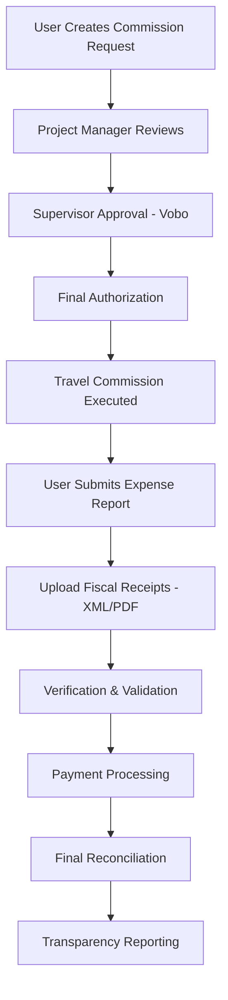

## What is SMAF?

SMAF (Sistema de Manejo de Asignaciones Federales) is an internal web-based application designed to manage and control travel expenses (viaticos) and travel allowances for the Mexican Federal Public Administration, specifically for INAPESCA (National Institute of Fisheries and Aquaculture).

The system streamlines the entire lifecycle of travel requests, from initial commission requests to final payment and expense verification, ensuring transparency and accountability in the use of federal resources.

## Main Features

<CardGroup cols={2}>
  <Card title="Commission Management" icon="briefcase">
    Create, track, and manage travel commission requests with detailed itineraries, objectives, and budget allocations
  </Card>
  
  <Card title="Multi-Level Authorization" icon="signature">
    Role-based authorization workflow including Project Managers, Supervisors (Vobo), and Final Authorizers
  </Card>
  
  <Card title="Expense Verification" icon="receipt">
    Submit and validate expense reports with XML fiscal receipts (CFDI v3.3 and v4.0) and supporting documentation
  </Card>
  
  <Card title="Payment Processing" icon="credit-card">
    Process travel allowance payments with bank account integration and payment tracking
  </Card>
  
  <Card title="Budget Control" icon="chart-line">
    Real-time budget tracking by project, program, and budget line item (partida presupuestal)
  </Card>
  
  <Card title="Transparency Reporting" icon="chart-bar">
    Generate reports for public transparency requirements and internal auditing
  </Card>
</CardGroup>

## User Roles

SMAF implements a comprehensive role-based access control system. Different users have different permissions and workflows:

<Steps>
  <Step title="Investigador (Researcher)">
    Request travel commissions, submit expense reports, and view their own commission history
  </Step>
  
  <Step title="Responsable de Proyecto (Project Manager)">
    Review and approve commission requests from their project team members
  </Step>
  
  <Step title="Vobo (Supervisor)">
    Provide supervisory approval (Visto Bueno) for commissions before final authorization
  </Step>
  
  <Step title="Autoriza (Authorizer)">
    Final approval authority for travel commissions and budget allocation
  </Step>
  
  <Step title="Jefe de Centro (Center Chief)">
    Manage all commissions for their research center with administrative oversight
  </Step>
  
  <Step title="Administrador (Administrator)">
    System administration, user management, and financial processing
  </Step>
  
  <Step title="Director General">
    Executive oversight with access to all system features and reports
  </Step>
</Steps>

## Request-to-Payment Lifecycle

The complete workflow in SMAF follows this lifecycle:



### 1. Commission Request Creation

Users create a commission request specifying:

- **Project Information**: Program, budget line, fiscal year
- **Travel Details**: Destination, dates, objective
- **Comisionados**: List of personnel traveling
- **Transportation**: Mode of transport (terrestrial, aerial, aquatic), vehicle details
- **Budget Items**: Travel allowances (viaticos), fuel, tolls, airfare

<CodeGroup>
```csharp Comision Entity (InapescaWeb.Entidades/Comision.cs)
public class Comision
{
    public string Folio { get; set; }
    public string Fecha_Solicitud { get; set; }
    public string Usuario_Solicita { get; set; }
    public string Proyecto { get; set; }
    public string Lugar { get; set; }
    public string Fecha_Inicio { get; set; }
    public string Fecha_Final { get; set; }
    public string Objetivo { get; set; }
    public string Clase_Trans { get; set; }
    public string Tipo_Trans { get; set; }
    public string Total_Viaticos { get; set; }
    public string Combustible_Solicitado { get; set; }
    public string Peaje { get; set; }
    public string Pasaje { get; set; }
    public string Estatus { get; set; }
}
```

```csharp Creating a Request (InapescaWeb/Solicitudes/Solicitud_Comision.aspx.cs)
protected void Page_Load(object sender, EventArgs e)
{
    if (!IsPostBack)
    {
        clsFuncionesGral.LlenarTreeViews(
            dictionary.NUMERO_CERO, 
            tvMenu, 
            false, 
            "Menu", 
            "SMAF", 
            Session["Crip_Rol"].ToString()
        );
        Carga_Valores();
        CrearTabla();
    }
}
```
</CodeGroup>

### 2. Authorization Workflow

Each commission goes through multiple approval stages:

<CodeGroup>
```csharp Authorization Logic (InapescaWeb/Autorizaciones/Comision_Aut.aspx.cs)
public void Crear_Tabla(string psPermisos)
{
    if (psPermisos == Dictionary.PERMISO_ADMINISTRADOR_LOCAL)
    {
        clsFuncionesGral.Activa_Paneles(pnlAutoriza, true);
        dplAutoriza.DataSource = MngNegocioComision.Obtiene_Solicitudes(
            Dictionary.AUTORIZA, 
            Session["Crip_Usuario"].ToString(), 
            "1"
        );
        dplAutoriza.DataTextField = Dictionary.DESCRIPCION;
        dplAutoriza.DataValueField = Dictionary.CODIGO;
        dplAutoriza.DataBind();
    }
    else
    {
        // Load both Vobo and Authorization panels
        clsFuncionesGral.Activa_Paneles(pnlVobo, true);
        dplVobo.DataSource = MngNegocioComision.Obtiene_Solicitudes(
            Dictionary.VOBO, 
            Session["Crip_Usuario"].ToString(), 
            "8"
        );
    }
}
```
</CodeGroup>

<Note>
The authorization workflow ensures proper budget oversight by requiring approval from:
1. **Responsable de Proyecto** - Project budget owner
2. **Vobo** - Supervisory approval
3. **Autoriza** - Final administrative authorization
</Note>

### 3. Expense Verification (Comprobación)

After travel completion, users submit expense reports with fiscal documentation:

<CodeGroup>
```csharp Expense Report Entity (InapescaWeb.Entidades/comprobacion.cs)
public class comprobacion
{
    public string Fecha { get; set; }
    public string Concepto { get; set; }
    public string Importe { get; set; }
    public string Observaciones { get; set; }
    public string Id { get; set; }
}
```

```csharp Processing Expenses (InapescaWeb.BRL/MngNegocioComision.cs)
public static Boolean Inserta_Comprobacion_Comision(
    string psOficio, 
    string psClvOficio, 
    string psComisionado, 
    string psUbicacionComisionado, 
    string psFechaFactura, 
    string psProyecto, 
    string psUbicacionProyecto, 
    string psTipoComprobacion, 
    string psClvConcepto, 
    string psDescripcionConcepto, 
    string psPdf, 
    string psImporte, 
    string psXml, 
    string psMetPago, 
    string psMetPagoUsser, 
    string psObservaciones, 
    string psDocumento, 
    string psTicket, 
    string psUUID, 
    string psPeriodo, 
    string psVersion = ""
)
{
    return MngDatosComision.Inserta_Comprobacion_Comision(
        psOficio, psClvOficio, psComisionado, psUbicacionComisionado, 
        psFechaFactura, psProyecto, psUbicacionProyecto, psTipoComprobacion, 
        psClvConcepto, psDescripcionConcepto, psPdf, psImporte, psXml, 
        psMetPago, psMetPagoUsser, psObservaciones, psDocumento, 
        psTicket, psUUID, psPeriodo, psVersion
    );
}
```
</CodeGroup>

<Warning>
All expense reports must include valid XML fiscal receipts (CFDI) with UUIDs. The system validates:
- XML structure (v3.3 or v4.0)
- Matching PDF documentation
- Payment methods
- Receipt amounts vs. authorized budget
</Warning>

### 4. Payment Processing

Once expenses are verified, payments are processed:

<CodeGroup>
```csharp Payment Module (InapescaWeb/Pagos/PagaViaticos.aspx.cs)
public void Carga_Valores()
{
    dplAnio.DataSource = MngNegocioAnio.ObtieneAnios();
    dplAnio.DataTextField = Dictionary.DESCRIPCION;
    dplAnio.DataValueField = Dictionary.CODIGO;
    dplAnio.DataBind();
    
    dplTipoMinistracion.DataSource = 
        MngNegocioMinistracion.ListaTipoMinistracion("00");
    dplTipoMinistracion.DataValueField = Dictionary.CODIGO;
    dplTipoMinistracion.DataTextField = Dictionary.DESCRIPCION;
    dplTipoMinistracion.DataBind();
    
    clsFuncionesGral.Llena_Lista(
        dplTipoPago, 
        "S e l e c c i o n e |deposito a cuenta"
    );
}
```
</CodeGroup>

### 5. Transparency and Reporting

SMAF generates comprehensive reports for transparency requirements:

```csharp
public static List<Comision> Lista_ComisionesTransparencia(string psYear)
{
    return MngDatosComision.Lista_ComisionesTransparencia(psYear);
}
```

## Key System Capabilities

### National and International Travel

The system supports both national and international commissions:

```csharp
if ((Session["Crip_Rol"].ToString() == dictionary.DIRECTOR_ADMINISTRACION) || 
    (Session["Crip_Rol"].ToString() == dictionary.DIRECTOR_GRAL))
{
    clsFuncionesGral.Llena_Lista(
        dplTipoComision, 
        "= S E L E C C I O N E =|NACIONAL|INTERNACIONAL"
    );
}
else
{
    clsFuncionesGral.Llena_Lista(
        dplTipoComision, 
        "= S E L E C C I O N E =|NACIONAL"
    );
}
```

### Multi-Zone Travel Allowances

Different daily allowance rates based on:
- **Commercial zones** (urban areas)
- **Rural zones** (field research locations)
- **Navigated days** (maritime research)
- **50km+ travel** (additional allowances)

### Budget Line Integration

All commissions are linked to:
- Fiscal year (PEF - Presupuesto de Egresos de la Federación)
- Program (Programa)
- Project (Proyecto)
- Budget line item (Partida Presupuestal)

## Session Management

SMAF implements secure session handling:

```csharp
// User authentication and session creation
Session.Timeout = 30;
Session.LCID = 2057;
Session["Crip_Usuario"] = oUsuario.Usser;
Session["Crip_Nivel"] = oUsuario.Nivel;
Session["Crip_Ubicacion"] = oUsuario.Ubicacion;
Session["Crip_Rol"] = oUsuario.Rol;

// Session timeout check
if (!clsFuncionesGral.IsSessionTimedOut())
{
    // Process request
}
else
{
    Response.Redirect("../Index.aspx", true);
}
```

## Next Steps

<CardGroup cols={2}>
  <Card title="Architecture" icon="diagram-project" href="/architecture">
    Learn about the three-tier architecture and technology stack
  </Card>
  
  <Card title="User Guide" icon="book" href="/user-guide">
    Step-by-step guides for common workflows
  </Card>
  
  <Card title="Solicitudes" icon="file-lines" href="/solicitudes">
    Create and manage commission requests
  </Card>
  
  <Card title="API Reference" icon="code" href="/api-reference">
    Technical API documentation
  </Card>
</CardGroup>
