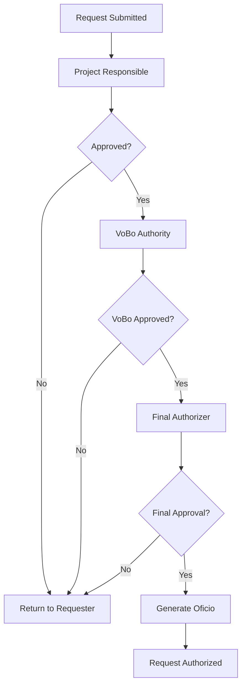

## Introduction

The SMAF (Sistema de Manejo de Administración Federal) Solicitudes module manages two primary types of requests for the Mexican Federal Public Administration:

1. **Travel Commission Requests (Solicitudes de Comisión)** - For official travel and expense management
2. **PSP Requests (Prestadores de Servicios Profesionales)** - For professional services contractor management

Each request type follows a structured approval workflow and requires specific documentation based on the nature of the request.

## Request Types

### Travel Commission Requests

Travel commission requests are used to authorize official travel for government employees. These requests include:

- **National Commissions** - Domestic travel within Mexico
- **International Commissions** - International travel (restricted to specific roles)
- **Commission Extensions (Ampliaciones)** - Extensions to existing travel authorizations

**Key Features:**
- Multi-step form with project allocation
- Commissioned personnel management
- Destination and date selection
- Transportation options (official vehicles, commercial transport)
- Budget allocation and expense tracking
- Equipment authorization

### PSP Requests (Professional Services)

PSP requests manage contracts for professional service providers. These include:

- Contractor personal information
- Tax and identification details (RFC, CLABE)
- Contract terms and financial details
- Service location assignment
- Multiple participant support (up to 3 participants)

## Request Lifecycle

<Steps>
  <Step title="Request Creation">
    User initiates a new request and completes all required form fields
  </Step>
  
  <Step title="Project Allocation">
    Request is linked to a specific program/project with budget verification
  </Step>
  
  <Step title="Responsible Review">
    Project responsible reviews and provides initial approval (`Fecha_Responsable`)
  </Step>
  
  <Step title="VoBo (Visto Bueno)">
    Regional director or designated authority provides VoBo approval (`Fecha_Vobo`)
  </Step>
  
  <Step title="Final Authorization">
    Administrative director or general director provides final authorization (`Fecha_Autoriza`)
  </Step>
  
  <Step title="Official Document Generation">
    System generates official documents (Oficio) with unique reference numbers
  </Step>
</Steps>

## Approval Workflow

The SMAF system implements a multi-level approval hierarchy:

### Key Status Fields

<ParamField path="Estatus" type="string">
  Current status of the request. Common values:
  - `0` - Draft/In Progress
  - `1` - Submitted for Approval
  - `2` - Approved by Responsible
  - `3` - VoBo Approved
  - `4` - Final Authorization
  - `9` - Pending Verification (Comprobación)
</ParamField>

<ParamField path="Fecha_Solicitud" type="date">
  Initial request submission date
</ParamField>

<ParamField path="Fecha_Responsable" type="date">
  Date when project responsible approved the request
</ParamField>

<ParamField path="Fecha_Vobo" type="date">
  Date when VoBo authority approved the request
</ParamField>

<ParamField path="Fecha_Autoriza" type="date">
  Date of final authorization
</ParamField>

## Required Documentation

### For Travel Commissions

- **Program Assignment**: Valid program/project code with available budget
- **Travel Justification**: Clear objective and business purpose
- **Itinerary Details**: Complete travel dates and destinations
- **Budget Breakdown**: Transportation, accommodation, per diem expenses
- **Special Permits**: Additional approvals for international travel or extended trips

### For PSP Requests

- **Contractor Identification**: Valid RFC, official ID, and tax registration
- **Banking Information**: 18-digit CLABE interbancaria for payments
- **Contract Scope**: Detailed description of services (max 255 characters)
- **Financial Details**: Monthly amount, IVA calculation, total contract value
- **Service Location**: Specific office assignment within INAPESCA facilities

<Warning>
  **Important Validation Rules**
  
  - PSP contract start dates can only be the 1st or 16th of each month
  - Travel commission requests require at least 3 business days advance notice
  - Commissioners with 3+ pending expense reports cannot submit new requests
  - Annual travel day limits apply (can be waived with special permission - OFMAY permit)
</Warning>

## System Validations

### Travel Request Validations

The system enforces several business rules:

1. **Pending Verifications**: Users with 3 or more unverified commission reports are blocked from new requests (unless they have VIAT special permission)

2. **Annual Limits**: Total commission days per calendar year cannot exceed configured limits (typically 90-120 days)

3. **10-Day Rule**: Commissioners must submit expense verification within 10 days of return date

4. **Role Restrictions**: International commissions require Director-level role or special authorization

### PSP Request Validations

- RFC must be exactly 13 characters
- CLABE must be exactly 18 numeric digits
- Email address format validation
- Numeric validation for phone numbers and amounts
- Special character filtering for name and address fields

<Note>
  All text inputs in PSP forms are automatically converted to uppercase for consistency in official documents.
</Note>

## Next Steps

<CardGroup cols={2}>
  <Card title="Travel Commission Requests" icon="plane" href="/solicitudes/comision-requests">
    Learn how to create and manage travel commission requests
  </Card>
  
  <Card title="PSP Requests" icon="file-contract" href="/solicitudes/psp-requests">
    Complete guide for professional services contractor requests
  </Card>
</CardGroup>