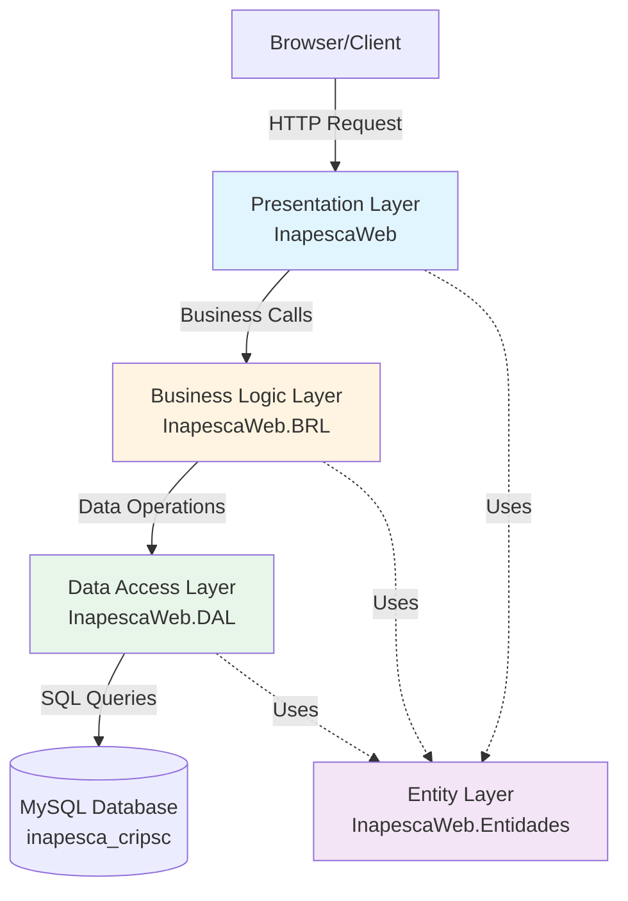

## Introduction

SMAF (Sistema de Manejo Administrativo y Financiero) is an internal expense and travel allowance control system for the Mexican Federal Public Administration, specifically developed for INAPESCA - CRIP Salina Cruz. The system is built using ASP.NET Web Forms with a traditional three-tier architecture pattern.

## Technology Stack

### Platform & Framework

<CardGroup cols={2}>
  <Card title=".NET Framework" icon="microsoft">
    Version 4.0 targeting Windows platform
  </Card>
  <Card title="ASP.NET Web Forms" icon="globe">
    Traditional server-side web application model
  </Card>
  <Card title="C#" icon="code">
    Primary programming language
  </Card>
  <Card title="Visual Studio 2010" icon="window">
    Development environment and tooling
  </Card>
</CardGroup>

### Database

- **Database Engine**: MySQL Server 5.6.17
- **Data Provider**: MySql.Data.dll (Version 6.6.5.0)
- **Database Name**: `inapesca_cripsc`

### Third-Party Components

<AccordionGroup>
  <Accordion title="UI Components">
    - **Telerik UI for ASP.NET AJAX** (Version 2014.2.618.40)
    - **Telerik Reporting** (Version 8.1.14.618)
    - **AjaxControlToolkit** (Version 4.1.40412.0)
  </Accordion>
  
  <Accordion title="Document Generation">
    - **iTextSharp** (Version 5.5.5) - PDF generation
    - **Microsoft ReportViewer** (Version 10.0.0.0)
  </Accordion>
  
  <Accordion title="Utilities">
    - **QRCoder** - QR code generation for documents
  </Accordion>
</AccordionGroup>

## Solution Structure

The SMAF system is organized as a Visual Studio Solution (`.sln`) containing four distinct projects:

```xml InapescaWeb.sln
Microsoft Visual Studio Solution File, Format Version 11.00
# Visual Studio 2010
Project("{FAE04EC0-301F-11D3-BF4B-00C04F79EFBC}") = "InapescaWeb"
Project("{FAE04EC0-301F-11D3-BF4B-00C04F79EFBC}") = "InapescaWeb.Entidades"
Project("{FAE04EC0-301F-11D3-BF4B-00C04F79EFBC}") = "InapescaWeb.BRL"
Project("{FAE04EC0-301F-11D3-BF4B-00C04F79EFBC}") = "InapescaWeb.DAL"
```

### Project Overview

<Steps>
  <Step title="InapescaWeb (Presentation Layer)">
    Main web application project containing ASPX pages, user controls, and UI logic. This is the entry point for all user interactions.
    
    **Project GUID**: `{090B5AA3-82FB-4607-BEE8-38EBDA114B4E}`
  </Step>
  
  <Step title="InapescaWeb.Entidades (Entity Layer)">
    Class library defining business entities and data transfer objects (DTOs) that represent the domain model.
    
    **Project GUID**: `{6B711C7C-3272-43FC-BB0C-A99E644DF90B}`
  </Step>
  
  <Step title="InapescaWeb.BRL (Business Rules Layer)">
    Business logic layer containing validation rules, calculations, and orchestration of business processes.
    
    **Project GUID**: `{9E452915-86A4-4499-B7C6-EDB42B6FF5EE}`
  </Step>
  
  <Step title="InapescaWeb.DAL (Data Access Layer)">
    Data access layer handling all database operations, connection management, and data persistence.
    
    **Project GUID**: `{1211AE21-A6A2-42F4-A400-BCC288C0D4A9}`
  </Step>
</Steps>

## Architectural Pattern

SMAF follows a **Three-Tier Architecture** pattern, providing clear separation of concerns:



## Key Features

### Functional Modules

The system is organized into functional areas based on directory structure:

<CardGroup cols={2}>
  <Card title="Solicitudes" icon="file-invoice">
    Travel commission request submission and management
  </Card>
  
  <Card title="Autorizaciones" icon="check-circle">
    Authorization workflow for commission requests
  </Card>
  
  <Card title="Comprobaciones" icon="receipt">
    Expense documentation and voucher submission
  </Card>
  
  <Card title="Pagos" icon="money-bill">
    Travel allowance payment processing
  </Card>
  
  <Card title="Ministraciones" icon="hand-holding-dollar">
    Budget allocation and fund disbursement
  </Card>
  
  <Card title="Reportes" icon="chart-bar">
    Reports and analytics for transparency
  </Card>
  
  <Card title="Catalogos" icon="database">
    Master data management (projects, programs, accounts)
  </Card>
  
  <Card title="Validaciones" icon="shield-check">
    Validation and verification processes
  </Card>
</CardGroup>

### Security Features

<Warning>
  Connection strings are encrypted using custom encryption methods in the `web.config` file.
</Warning>

```xml web.config:45-47
<add key="localhost" 
     value="tGf1BXWYdXKSsk+PoraCYtfZx2CaCz+YSH7fEzln+tPCCIPyhXka5KxFVkYaJDYXUGY8BwEgL2KIww23CpBtBw==" />
```

The system includes:
- Password encryption for user authentication
- Role-based access control (RBAC)
- Session management
- X-Frame-Options security header

## Deployment Configuration

### Build Configuration

The solution supports two build configurations:

- **Debug**: Full debugging symbols, no optimization
- **Release**: Optimized code, minimal debugging information

### Target Framework

```xml
<TargetFrameworkVersion>v4.0</TargetFrameworkVersion>
```

All projects target .NET Framework 4.0 for compatibility with the deployment environment.

## Connection Management

The system supports multiple database connections for different modules:

```csharp MngConexion.cs:33-40
public static MySqlConnection getConexionMysql()
{
    string CadenaConexionEncriptada = ConfigurationManager.AppSettings["localhost"];
    string CadenaConexion = MngEncriptacion.decripString(CadenaConexionEncriptada);
    ConexionMysql = new MySqlConnection(CadenaConexion);
    return ConexionMysql;
}
```

<Info>
  The system includes dedicated connection methods for different databases:
  - Main SMAF database (`getConexionMysql`)
  - DGAIPP database (`getConexionMysql_dgaipp`)
  - Contracts module (`getConexionMysql_Contratos`)
  - Consultation module (`getConexionMysql_ModuloConsulta`)
</Info>

## Design Principles

1. **Separation of Concerns**: Clear boundaries between presentation, business logic, and data access
2. **Reusability**: Common entities and business logic shared across layers
3. **Maintainability**: Modular structure allows independent development and testing
4. **Scalability**: Stateless business logic tier supports horizontal scaling

## Next Steps

<CardGroup cols={2}>
  <Card title="Three-Tier Architecture" icon="layer-group" href="/technical/three-tier-architecture">
    Deep dive into the three-tier implementation
  </Card>
  
  <Card title="Database Schema" icon="database" href="/technical/database-schema">
    Explore the MySQL database structure
  </Card>
</CardGroup>