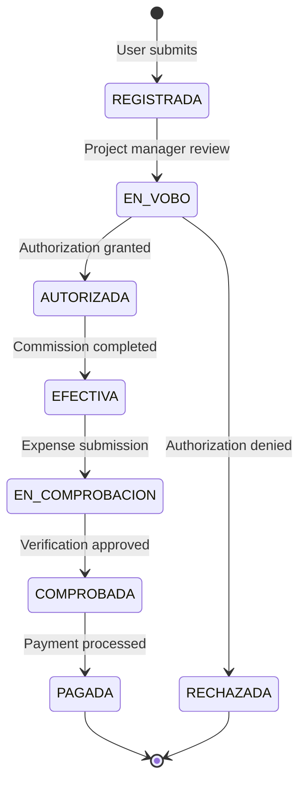

## Purpose

The Business Rules Layer (BRL) serves as the **intermediary tier** between the Presentation Layer and the Data Access Layer (DAL) in SMAF's three-tier architecture. This layer encapsulates all business logic, validation rules, and domain-specific operations for expense and travel allowance management.

### Key Responsibilities

<CardGroup cols={2}>
  <Card title="Business Logic Enforcement" icon="gavel">
    Implements Mexican Federal Public Administration expense policies and validation rules
  </Card>
  <Card title="Data Orchestration" icon="network-wired">
    Coordinates complex operations across multiple DAL components
  </Card>
  <Card title="Authorization Workflows" icon="key">
    Manages approval chains and status transitions for commissions and expenses
  </Card>
  <Card title="Calculation Engine" icon="calculator">
    Computes travel allowances, reimbursements, and budget allocations
  </Card>
</CardGroup>

## Architecture Pattern

The BRL implements a **Manager-based pattern** where each domain entity has a dedicated manager class:

```csharp
namespace InapescaWeb.BRL
{
    public class MngNegocio[Entity]
    {
        // Static methods that delegate to DAL
        public static Entity Method(parameters)
        {
            return MngDatos[Entity].Method(parameters);
        }
    }
}
```

### Core Manager Classes

| Manager Class | Domain Responsibility |
|--------------|----------------------|
| `MngNegocioComision` | Commission lifecycle management and CRUD operations |
| `MngNegocioComprobacion` | Expense verification and fiscal compliance validation |
| `MngNegocioPago` | Payment processing and disbursement logic |
| `MngNegocioMinistracion` | Budget allocation and fund release management |
| `MngNegocioViaticos` | Travel allowance rate calculations |
| `MngNegocioXml` | CFDI invoice XML processing and validation |
| `MngNegocioGenerarRef` | Bank reference generation for payments |

## Design Principles

### 1. Stateless Operations

All BRL methods are **static** and stateless, enabling simplified invocation from the presentation layer:

```csharp
// Example: Retrieve commission details
Comision commission = MngNegocioComision.Detalle_Comision(
    psFolio: "2024-001",
    psDep: "CRIP-SC",
    psComisionado: "JALP001",
    psEstatus: "AUTORIZADA"
);
```

### 2. Separation of Concerns

The BRL **never** accesses the database directly. All data persistence operations are delegated to the DAL:

```csharp
public static List<Comision> Regresa_ListComision(
    string psUsuario, 
    string psPeriodo, 
    string psEstatus = "")
{
    // Delegates to DAL - no database logic here
    return MngDatosComision.Regresa_ListComision(psUsuario, psPeriodo, psEstatus);
}
```

### 3. Validation Before Persistence

Business rules are enforced in the BRL before data reaches the DAL:

<AccordionGroup>
  <Accordion title="Commission Date Overlap Validation">
    The BRL validates that commission dates do not overlap for the same employee:
    
    ```csharp
    public static bool Comision_Extraordinaria(
        string psUsuario, 
        string psFechaInicio, 
        string psFechaFinal, 
        string psOpcion)
    {
        return MngDatosComision.Comision_Extraordinaria(
            psUsuario, psFechaInicio, psFechaFinal, psOpcion
        );
    }
    ```
  </Accordion>
  
  <Accordion title="Continuous Day Accumulation">
    Enforces SAT regulations on continuous travel day limits:
    
    ```csharp
    public static string Obtiene_Dias_Continuos(
        string psFechas, 
        string psComisionado, 
        string psTerritorio)
    {
        return MngDatosComision.Obtiene_Dias_Continuos(
            psFechas, psComisionado, psTerritorio
        );
    }
    ```
  </Accordion>
  
  <Accordion title="UUID Uniqueness for CFDI Invoices">
    Prevents duplicate invoice submission:
    
    ```csharp
    public static string Exist_UUUID(string psUUID)
    {
        return MngDatosComprobacion.Exist_UUUID(psUUID);
    }
    ```
  </Accordion>
</AccordionGroup>

## Parameter Naming Convention

The BRL uses **Hungarian notation** with prefixes indicating data types:

<ParamField path="ps[Name]" type="string">
  String parameters (e.g., `psUsuario`, `psFolio`, `psEstatus`)
</ParamField>

<ParamField path="pi[Name]" type="int">
  Integer parameters (e.g., `piOpcion`, `piSecuencia`)
</ParamField>

<ParamField path="pb[Name]" type="bool">
  Boolean parameters (e.g., `pbBandera`, `pbUsuarioPagador`)
</ParamField>

<ParamField path="po[Name]" type="object">
  Object parameters (e.g., `poComision`, `poEntidad`)
</ParamField>

## Status Transition Management

The BRL orchestrates complex state machines for commission workflows:



### Status Update Method

```csharp
public static bool Update_estatus_Comision(
    string psEstatus, 
    string psUsuario = "", 
    string psFolio = "", 
    string psDep = "", 
    string psArchivo = "", 
    string psObservaciones = "", 
    bool x = false)
{
    return MngDatosComision.Update_estatus_Comision(
        psEstatus, psUsuario, psFolio, psDep, psArchivo, psObservaciones, x
    );
}
```

## Transaction Coordination

While individual BRL methods are stateless, complex operations require coordinated calls:

```csharp
// Example: Commission authorization workflow
// Step 1: Update commission status
MngNegocioComision.Update_estatus_Comision(
    psEstatus: "AUTORIZADA",
    psUsuario: currentUser,
    psFolio: folioNumber,
    psDep: department,
    psArchivo: archiveId
);

// Step 2: Generate official document
MngNegocioComision.Inserta_Oficio_Comision(
    poComision: commissionObject,
    psOficio: officialDocumentNumber
);

// Step 3: Update file paths
MngNegocioComision.Update_ruta_Comision(
    psRuta: documentPath,
    psArchivo: archiveId,
    psDep: department,
    psComisionado: employeeId,
    psOficio: officialDocumentNumber,
    poComision: commissionObject
);
```

<Warning>
  The presentation layer is responsible for **transaction management** when coordinating multiple BRL calls. Each BRL method executes independently.
</Warning>

## Error Handling Philosophy

BRL methods typically return:

- **Boolean** for success/failure operations
- **String** for calculated values or validation messages  
- **Entity objects** for data retrieval
- **Lists** for collection queries

```csharp
// Boolean return example
public static Boolean Inserta_Comision(
    string psClv_Oficio,
    string psTipoComision,
    // ... many parameters ...
    string psPais, 
    string psEstado)
{
    return MngDatosComision.Insert_Comision(
        psClv_Oficio, psTipoComision, /* ... */ psPais, psEstado
    );
}
```

<Note>
  Exceptions are **not caught** in the BRL - they bubble up to the presentation layer for user-facing error messages.
</Note>

## Integration with Entities

The BRL heavily uses entity classes from `InapescaWeb.Entidades` namespace:

```csharp
using InapescaWeb.Entidades;

// Entity usage example
public static Comision Detalle_Comision(
    string psFolio, 
    string psDep, 
    string psComisionado = "",
    string psEstatus = "")
{
    return MngDatosComision.Detalle_Comision(
        psFolio, psDep, psComisionado, psEstatus
    );
}
```

### Common Entity Types

- **Comision**: Full commission details with nested properties
- **Entidad**: Generic key-value entity for dropdowns and catalogs
- **GridView**: Specialized entity for data table binding
- **comprobacion**: Expense verification details
- **Ministracion**: Budget allocation records

## Performance Considerations

<CardGroup cols={2}>
  <Card title="Thin Layer Pattern" icon="layer-group">
    Most methods are simple pass-through calls, minimizing overhead
  </Card>
  <Card title="Dataset Returns" icon="table">
    Some methods return `DataSet` for complex multi-table results
  </Card>
  <Card title="Optional Parameters" icon="sliders">
    Extensive use of optional parameters reduces method proliferation
  </Card>
  <Card title="String-based Logic" icon="text">
    Calculations return strings to avoid decimal precision issues
  </Card>
</CardGroup>

## Best Practices for BRL Development

1. **Always validate inputs** before passing to DAL
2. **Use descriptive parameter names** following Hungarian notation
3. **Return meaningful values** - empty strings, nulls, or zero for invalid states
4. **Keep methods stateless** - no class-level variables
5. **Delegate all database operations** to the DAL layer
6. **Document business rules** in code comments

## Related Documentation

<CardGroup cols={2}>
  <Card title="Commission Management" href="./commission-management" icon="briefcase">
    Deep dive into MngNegocioComision methods
  </Card>
  <Card title="Verification Management" href="./verification-management" icon="check-circle">
    Expense validation and reimbursement logic
  </Card>
  <Card title="Payment Management" href="./payment-management" icon="money-bill">
    Payment processing and bank reference generation
  </Card>
  <Card title="Data Access Layer" href="../dal/overview" icon="database">
    Understanding the DAL that BRL depends on
  </Card>
</CardGroup>