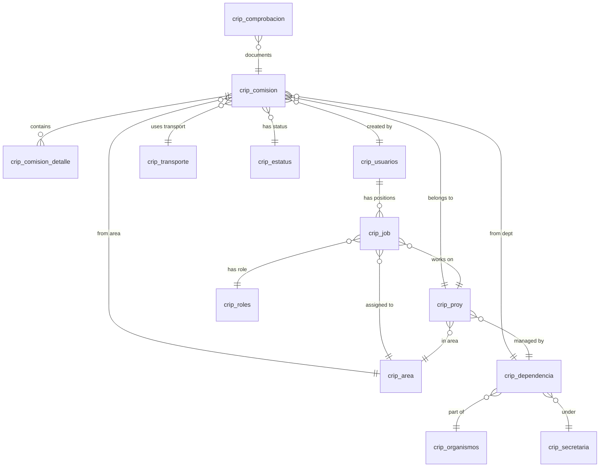
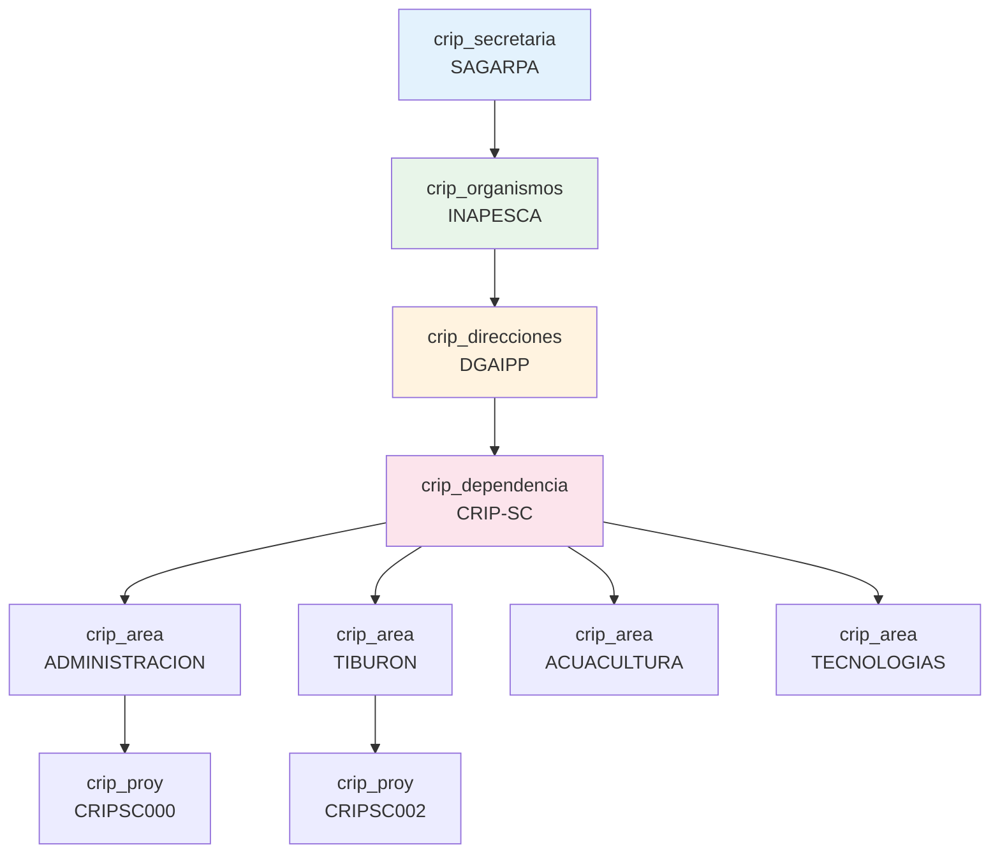
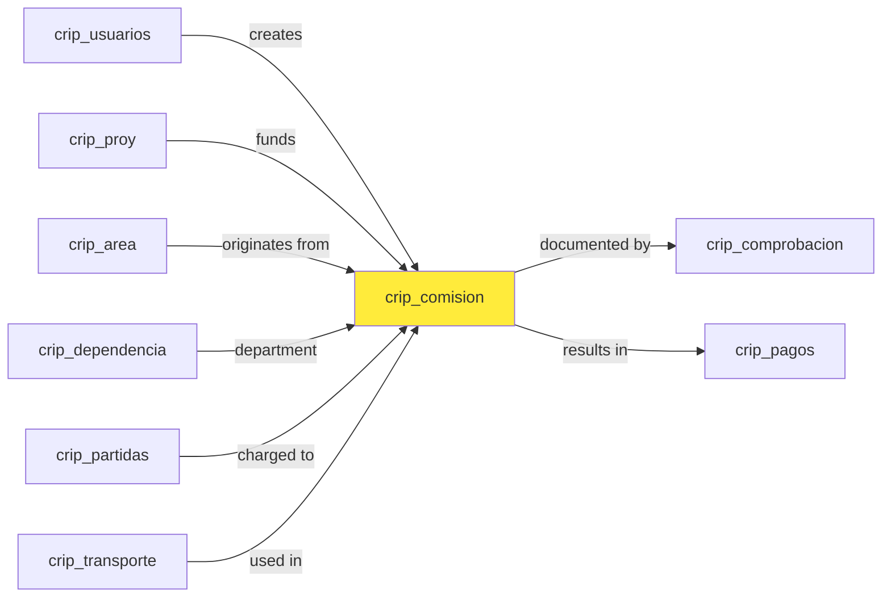
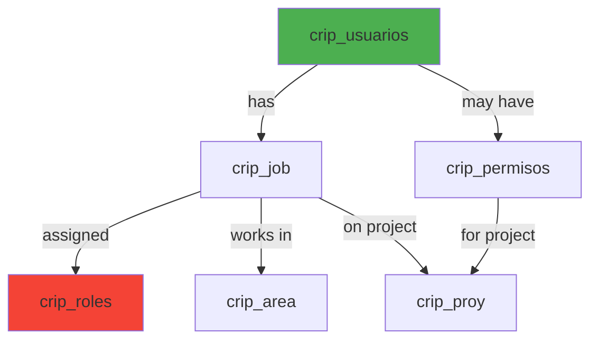

## Database Overview

SMAF uses a MySQL database (version 5.6.17) named `inapesca_cripsc` to store all application data. The schema follows a relational design with extensive use of foreign keys to maintain referential integrity.

### Database Information

```sql
Source Server: localhost
Source Server Version: 50617
Source Database: inapesca_cripsc
Target Server Type: MYSQL
Engine: InnoDB
Character Set: latin1
```

<Info>
  All tables use the **InnoDB storage engine** which provides ACID compliance, foreign key support, and crash recovery.
</Info>

## Entity Relationship Overview

The database schema is organized around core business entities:



## Core Tables

### crip_comision (Commission Requests)

The central table storing travel commission requests and authorizations.

```sql inapesca_cripsc.sql:68-146
CREATE TABLE `crip_comision` (
  `CVL_OFICIO` varchar(8) NOT NULL,
  `FOLIO` int(6) NOT NULL,
  `NO_OFICIO` int(6) DEFAULT NULL,
  `FECHA_SOL` date NOT NULL,
  `FECHA_RESP` date DEFAULT NULL,
  `FECHA_VoBo` date DEFAULT NULL,
  `FECHA_AUTORIZA` date DEFAULT NULL,
  `USSER` varchar(255) DEFAULT NULL,
  `CLV_DEP` varchar(8) NOT NULL,
  `CLV_AREA` varchar(8) NOT NULL,
  `CLV_PROY` varchar(10) NOT NULL,
  `LUGAR` varchar(255) NOT NULL,
  `TELEFONO` int(15) DEFAULT NULL,
  `CAPITULO` varchar(50) DEFAULT NULL,
  `PROCESO` varchar(50) DEFAULT NULL,
  `INDICADOR` varchar(50) DEFAULT NULL,
  `PART_PRESUPUESTAL` varchar(50) DEFAULT NULL,
  `FECHA_I` date NOT NULL,
  `FECHA_F` date NOT NULL,
  `DIAS_TOTAL` int(2) DEFAULT NULL,
  `DIAS_REALES` double(2,1) DEFAULT NULL,
  `OBJETIVO` varchar(255) DEFAULT NULL,
  `CLV_CLASE` varchar(3) NOT NULL,
  `CLV_TIPO_TRANS` varchar(2) NOT NULL,
  `CLV_TRANS-SOL` varchar(4) NOT NULL,
  `CLV_TRANS_AUT` varchar(4) NOT NULL,
  `DESC_AUTO` varchar(255) DEFAULT NULL,
  `COMBUSTIBLE_SOL` double(5,2) DEFAULT NULL,
  `COMBUSTIBLE_AUT` double(5,2) DEFAULT NULL,
  `MET_VIATICOS` varchar(2) DEFAULT NULL,
  `SECEFF` int(2) NOT NULL DEFAULT '0',
  `EQUIPO` varchar(255) DEFAULT NULL,
  `OBSERVACIONES_SOL` varchar(255) DEFAULT NULL,
  `RESP_PROY` varchar(25) NOT NULL,
  `VoBo` varchar(150) DEFAULT NULL,
  `AUTORIZA` varchar(150) DEFAULT NULL,
  `USUARIO` varchar(25) NOT NULL,
  `CLV_DEP_COM` varchar(8) NOT NULL,
  `ESTATUS` int(1) NOT NULL,
  `OBSERVACIONES_VoBo` varchar(255) DEFAULT NULL,
  `OBSERVACIONES_AUT` varchar(255) DEFAULT NULL,
  PRIMARY KEY (`CVL_OFICIO`,`FOLIO`,`SECEFF`)
) ENGINE=InnoDB DEFAULT CHARSET=latin1;
```

<Tabs>
  <Tab title="Key Fields">
    <ResponseField name="CVL_OFICIO" type="varchar(8)" required>
      Office/document type key
    </ResponseField>
    
    <ResponseField name="FOLIO" type="int(6)" required>
      Unique folio number for the commission request
    </ResponseField>
    
    <ResponseField name="FECHA_SOL" type="date" required>
      Request submission date
    </ResponseField>
    
    <ResponseField name="FECHA_I / FECHA_F" type="date" required>
      Start and end dates of the commission
    </ResponseField>
    
    <ResponseField name="CLV_PROY" type="varchar(10)" required>
      Project code (FK to crip_proy)
    </ResponseField>
    
    <ResponseField name="ESTATUS" type="int(1)" required>
      Commission status (FK to crip_estatus)
    </ResponseField>
  </Tab>
  
  <Tab title="Foreign Keys">
    ```sql
    CONSTRAINT `crip_comision_ibfk_1` FOREIGN KEY (`CVL_OFICIO`) 
        REFERENCES `crip_oficio` (`CLV_TIPO_O`)
    CONSTRAINT `crip_comision_ibfk_11` FOREIGN KEY (`MET_VIATICOS`) 
        REFERENCES `crip_mviaticos` (`CLV_MET`)
    CONSTRAINT `crip_comision_ibfk_12` FOREIGN KEY (`USUARIO`) 
        REFERENCES `crip_usuarios` (`USUARIO`)
    CONSTRAINT `crip_comision_ibfk_14` FOREIGN KEY (`CLV_AREA`) 
        REFERENCES `crip_area` (`CLV_AREA`)
    CONSTRAINT `crip_comision_ibfk_15` FOREIGN KEY (`CLV_PROY`) 
        REFERENCES `crip_proy` (`CLV-PROY`)
    CONSTRAINT `crip_comision_ibfk_5` FOREIGN KEY (`ESTATUS`) 
        REFERENCES `crip_estatus` (`CLV_ESTATUS`)
    ```
  </Tab>
  
  <Tab title="Indexes">
    - Primary Key: `(CVL_OFICIO, FOLIO, SECEFF)`
    - Index on: `ESTATUS`, `MET_VIATICOS`, `USUARIO`, `CLV_AREA`, `CLV_PROY`
    - Index on: `RESP_PROY`, `FOLIO`, `FECHA_I`, `FECHA_F`
    - Index on: `CLV_CLASE`, `CLV_TIPO_TRANS`, transport keys
  </Tab>
</Tabs>

### crip_comprobacion (Expense Documentation)

Stores expense vouchers and documentation for commission expenses.

<Note>
  This table is referenced in the application but its full schema definition continues beyond the initial SQL excerpt. It contains fields for tracking receipts, XML invoices, and reimbursement amounts.
</Note>

### crip_usuarios (Users)

Stores user account information.

```sql inapesca_cripsc.sql (structure based on references)
CREATE TABLE `crip_usuarios` (
  `USUARIO` varchar(25) NOT NULL,
  -- User identification and authentication fields
  -- Personal information fields
  -- Contact information
  PRIMARY KEY (`USUARIO`)
) ENGINE=InnoDB DEFAULT CHARSET=latin1;
```

<Info>
  Users are referenced throughout the system via the `USUARIO` field (typically RFC/CURP identifiers).
</Info>

### crip_proyectos (Projects)

Manages research projects and administrative programs.

```sql inapesca_cripsc.sql:698-722
CREATE TABLE `crip_proy` (
  `CLV-PROY` varchar(10) NOT NULL DEFAULT '',
  `DESCRIPCION` varchar(150) NOT NULL,
  `RESPONSABLE` varchar(25) NOT NULL,
  `OBJETIVO` varchar(255) NOT NULL,
  `PERIODO` varchar(10) NOT NULL,
  `SEC_EFF` int(3) NOT NULL,
  `ESTATUS` int(1) NOT NULL,
  `FECHA` date NOT NULL,
  `FECH-EFF` date NOT NULL,
  `CLV_DEP` varchar(8) NOT NULL,
  `CLV_AREA` varchar(8) NOT NULL DEFAULT '',
  `RECURSO` double DEFAULT NULL,
  `RESTANTE` double DEFAULT NULL,
  PRIMARY KEY (`CLV-PROY`,`SEC_EFF`,`ESTATUS`,`CLV_DEP`,`CLV_AREA`),
  CONSTRAINT `crip_proy_ibfk_2` FOREIGN KEY (`ESTATUS`) 
      REFERENCES `crip_estatus` (`CLV_ESTATUS`),
  CONSTRAINT `crip_proy_ibfk_4` FOREIGN KEY (`CLV_AREA`) 
      REFERENCES `crip_area` (`CLV_AREA`),
  CONSTRAINT `crip_proy_ibfk_5` FOREIGN KEY (`CLV_DEP`) 
      REFERENCES `crip_dependencia` (`CLV_DEP`),
  CONSTRAINT `crip_proy_ibfk_6` FOREIGN KEY (`RESPONSABLE`) 
      REFERENCES `crip_usuarios` (`USUARIO`)
) ENGINE=InnoDB DEFAULT CHARSET=latin1;
```

#### Sample Project Data

```sql inapesca_cripsc.sql:727-735
INSERT INTO `crip_proy` VALUES 
('CRIPSC000', 'ADMINISTRACION', 'MOPO670124CX7', 'ADMINISTRACION', 
 '2014', '1', '1', '2014-01-01', '2014-01-01', 'CRIP-SC', 'CRIPSC01', 
 1000000, 100000);

INSERT INTO `crip_proy` VALUES 
('CRIPSC002', 'COORDINACION DE LA INVESTIGACION Y ATENCION AL SECTOR', 
 'MOPO670124CX7', '...', '2014', '1', '1', '2014-01-01', '2014-01-01', 
 'CRIP-SC', 'CRIPSC08', 1000000, 100000);
```

## Organization Structure Tables

### crip_dependencia (Departments)

Organizational units within the federal administration.

```sql inapesca_cripsc.sql:155-188
CREATE TABLE `crip_dependencia` (
  `CLV_DEP` varchar(8) NOT NULL,
  `DESCRIPCION` varchar(100) NOT NULL,
  `DESCR_CORTO` varchar(50) NOT NULL,
  `CLV_SECRE` varchar(15) NOT NULL,
  `CLV_ORG` varchar(10) NOT NULL,
  `CLV_DIR` varchar(10) NOT NULL,
  -- Address fields
  `CALLE` varchar(100) DEFAULT NULL,
  `NUM_EXT` varchar(5) DEFAULT NULL,
  `COL` varchar(100) DEFAULT NULL,
  `C.P.` varchar(7) DEFAULT NULL,
  `CIUDAD` varchar(100) DEFAULT NULL,
  `CLV_ESTADO` varchar(3) NOT NULL,
  -- Contact fields
  `TEL_1` varchar(15) DEFAULT NULL,
  `EMAIL_1` varchar(40) DEFAULT NULL,
  `ESTATUS` int(1) NOT NULL,
  PRIMARY KEY (`CLV_DEP`,`CLV_SECRE`,`CLV_ORG`,`SECEFF`)
) ENGINE=InnoDB DEFAULT CHARSET=latin1;
```

#### Sample Department Data

```sql inapesca_cripsc.sql:196
INSERT INTO `crip_dependencia` VALUES 
('CRIP-SC', 'CENTRO REGIONAL DE INVESTIGACION PESQUERA SALINA CRUZ', 
 'CRIP SALINA CRUZ', 'SAGARPA', 'INAPESCA', 'DGAIPP', 
 'PROLONGACION PLAYA ABIERTA', 'S/N', null, 'MIRAMAR', '7680', 
 'SALINA CRUZ', '20', 'MEX', '9717145003', '9717140386', null, 
 'admon_ps@prodigy.net.mx', 'cripsc@prodigy.net.mx', 
 '1900-01-01', '2014-11-13', '1', '1');
```

### crip_area (Areas)

Functional areas within departments.

```sql inapesca_cripsc.sql:22-30
CREATE TABLE `crip_area` (
  `CLV_AREA` varchar(8) NOT NULL DEFAULT '',
  `DESCRIPCION` varchar(50) DEFAULT NULL,
  `CLV_DEP` varchar(8) NOT NULL,
  PRIMARY KEY (`CLV_AREA`),
  CONSTRAINT `crip_area_ibfk_1` FOREIGN KEY (`CLV_DEP`) 
      REFERENCES `crip_dependencia` (`CLV_DEP`)
) ENGINE=InnoDB DEFAULT CHARSET=latin1;
```

#### Sample Area Data

```sql inapesca_cripsc.sql:35-42
INSERT INTO `crip_area` VALUES 
('CRIPSC01', 'ADMINISTRACION', 'CRIP-SC'),
('CRIPSC02', 'TIBURON', 'CRIP-SC'),
('CRIPSC03', 'ACUACULTURA', 'CRIP-SC'),
('CRIPSC04', 'TECNOLOGIAS DE CAPTURAS', 'CRIP-SC'),
('CRIPSC05', 'PESCA RIBEREÑA', 'CRIP-SC'),
('CRIPSC06', 'CAMARON', 'CRIP-SC'),
('CRIPSC08', 'JEFATURA DE CENTRO', 'CRIP-SC');
```

### Organizational Hierarchy



## Budget and Financial Tables

### crip_partidas (Budget Line Items)

Hierarchical budget classification system following Mexican federal budget structure.

```sql inapesca_cripsc.sql:516-526
CREATE TABLE `crip_partidas` (
  `ID` varchar(6) NOT NULL,
  `DESCRIPCION` varchar(255) NOT NULL,
  `PADRE` varchar(6) NOT NULL,
  `ESTATUS` int(1) NOT NULL DEFAULT '1',
  `PERIODO` varchar(4) NOT NULL DEFAULT '2015',
  PRIMARY KEY (`ID`),
  CONSTRAINT `crip_partidas_ibfk_1` FOREIGN KEY (`ESTATUS`) 
      REFERENCES `crip_estatus` (`CLV_ESTATUS`)
) ENGINE=InnoDB DEFAULT CHARSET=latin1;
```

<Tabs>
  <Tab title="Chapter 2000 - Materials">
    ```sql
    ('2000', 'MATERIALES Y SUMINISTROS', '0', '1', '2015')
    ('2100', 'MATERIALES DE ADMINISTRACIÓN...', '2000', '1', '2015')
    ('21101', 'MATERIALES Y ÚTILES DE OFICINAS', '2100', '1', '2015')
    ('2600', 'COMBUSTIBLES, LUBRICANTES Y ADITIVOS', '2000', '1', '2015')
    ('26102', 'COMBUSTIBLES...PARA VEHÍCULOS TERRESTRES', '2600', '1')
    ```
  </Tab>
  
  <Tab title="Chapter 3000 - Services">
    ```sql
    ('3000', 'SERVICIOS', '0', '1', '2015')
    ('3700', 'SERVICIOS DE TRASLADO Y VIÁTICOS', '3000', '1', '2015')
    ('37101', 'PASAJES AÉREOS NACIONALES...', '3700', '1', '2015')
    ('37104', 'PASAJES AÉREOS NAC. PARA SERVI. PÚBLI...', '3700', '1')
    ('37501', 'VIÁTICOS NACIONALES...', '3700', '1', '2015')
    ('37504', 'VIÁTICOS NACIONALES PARA SERVIDORES PÚBLICOS', '3700')
    ```
  </Tab>
  
  <Tab title="Chapter 5000 - Assets">
    ```sql
    ('5000', 'BIENES MUEBLES, INMUEBELES E INTANGIBLES', '0', '1')
    ('51101', 'MOBILIARIO. BIEN INSTRUMENTAL', '5000', '1', '2015')
    ('53101', 'EQUIPO MÉDICO Y DE LABORATORIO', '5000', '1', '2015')
    ```
  </Tab>
</Tabs>

<Info>
  The hierarchical budget structure uses the `PADRE` (parent) field to create a tree structure. Root items have `PADRE = '0'`.
</Info>

## Security and User Management Tables

### crip_job (User Positions/Roles)

Links users to their organizational positions and roles.

```sql inapesca_cripsc.sql:375-417
CREATE TABLE `crip_job` (
  `USUARIO` varchar(25) NOT NULL DEFAULT '',
  `PASSWORD` varchar(100) NOT NULL,
  `EMAIL_INST` varchar(100) NOT NULL,
  `CARGO` varchar(50) NOT NULL,
  `CLV_NIVEL` varchar(15) NOT NULL,
  `CLV_PLAZA` varchar(10) NOT NULL DEFAULT '',
  `CLV_PUESTO` varchar(100) NOT NULL,
  `CLV_SECRE` varchar(15) NOT NULL,
  `CLV_ORG` varchar(10) NOT NULL,
  `CLV_DEP` varchar(8) NOT NULL,
  `CLV_AREA` varchar(8) NOT NULL,
  `CLV_PROY` varchar(10) NOT NULL,
  `FECH_ALTA` date NOT NULL,
  `FECH_EFF` date NOT NULL,
  `ESTATUS` int(1) NOT NULL,
  `SEC_EFF` int(6) NOT NULL,
  `ROL` varchar(9) NOT NULL,
  PRIMARY KEY (`USUARIO`,`CLV_NIVEL`,`CLV_PLAZA`,`CLV_PUESTO`,`CLV_PROY`,`SEC_EFF`),
  CONSTRAINT `crip_job_ibfk_7` FOREIGN KEY (`ROL`) 
      REFERENCES `crip_roles` (`CLV_ROL`)
) ENGINE=InnoDB DEFAULT CHARSET=latin1;
```

<Warning>
  Passwords are stored encrypted using the system's encryption methods (see `MngEncriptacion` class).
</Warning>

### crip_roles (User Roles)

Defines system roles for access control.

```sql inapesca_cripsc.sql:778-794
CREATE TABLE `crip_roles` (
  `CLV_ROL` varchar(9) NOT NULL DEFAULT '',
  `DESCR` varchar(50) DEFAULT NULL,
  `DESC_LARGA` varchar(150) DEFAULT NULL,
  PRIMARY KEY (`CLV_ROL`)
) ENGINE=InnoDB DEFAULT CHARSET=latin1;

INSERT INTO `crip_roles` VALUES 
('ADMCRIPSC', 'ADMINISTRADOR CRIP SALINACRUZ', '...'),
('ADMGR', 'ADMINISTRADOR GENERAL', 'ROL CREADO PARA EL DBA - SYSTEM'),
('ADMINP', 'ADMINISTRADOR INAPESCA', '...'),
('INVEST', 'INVESTIGADOR', 'ROL CREADO PARA INVESTIGADORES (USUARIOS SIN PRIVILEGIOS DE ADMINISTRADOR)'),
('JFCCRIPSC', 'JEFE DE CENTRO SALINA CRUZ', '...');
```

### crip_permisos (Permissions)

External authorization permissions for specific projects.

```sql inapesca_cripsc.sql:672-687
CREATE TABLE `crip_permisos` (
  `CLV_USUARIO` varchar(25) NOT NULL,
  `PERMISO` varchar(25) NOT NULL,
  `AUT_EXTERNO` varchar(25) NOT NULL,
  `CLV_PROY` varchar(10) NOT NULL,
  `ESTATUS` int(1) NOT NULL,
  PRIMARY KEY (`CLV_USUARIO`),
  CONSTRAINT `crip_permisos_ibfk_1` FOREIGN KEY (`CLV_USUARIO`) 
      REFERENCES `crip_usuarios` (`USUARIO`),
  CONSTRAINT `crip_permisos_ibfk_5` FOREIGN KEY (`AUT_EXTERNO`) 
      REFERENCES `crip_proy` (`RESPONSABLE`)
) ENGINE=InnoDB DEFAULT CHARSET=latin1;
```

## Support Tables

### crip_estatus (Status Codes)

Standardized status values used throughout the system.

```sql inapesca_cripsc.sql:246-260
CREATE TABLE `crip_estatus` (
  `CLV_ESTATUS` int(1) NOT NULL,
  `DESCRIPCION` varchar(100) NOT NULL,
  PRIMARY KEY (`CLV_ESTATUS`)
) ENGINE=InnoDB DEFAULT CHARSET=latin1;

INSERT INTO `crip_estatus` VALUES 
('0', 'INACTIVO'),
('1', 'ACTIVO'),
('2', 'CANCELADO'),
('3', 'RECHAZADO'),
('4', 'EN TRAMITE DE BAJA');
```

### crip_transporte (Transportation)

Vehicles and transportation assets.

```sql inapesca_cripsc.sql:821-845
CREATE TABLE `crip_transporte` (
  `CLV_TRANSPORTE` varchar(4) NOT NULL,
  `CLV_CLASE` varchar(3) NOT NULL,
  `DESC_CLASE` varchar(150) NOT NULL,
  `TIPO` varchar(2) NOT NULL,
  `DESC_TIPO` varchar(50) NOT NULL,
  `N_ECO` int(2) DEFAULT NULL,
  `DESCRIPCION` varchar(100) DEFAULT NULL,
  `MARCA` varchar(25) DEFAULT NULL,
  `MODELO` int(4) DEFAULT NULL,
  `PLACAS` varchar(20) DEFAULT NULL,
  `ESTATUS` int(1) NOT NULL,
  `CLV_DEP` varchar(8) NOT NULL,
  PRIMARY KEY (`CLV_TRANSPORTE`)
) ENGINE=InnoDB DEFAULT CHARSET=latin1;
```

#### Sample Transportation Data

```sql inapesca_cripsc.sql:850
INSERT INTO `crip_transporte` VALUES 
('T001', 'TER', 'TERRESTRE', 'VO', 'VEHICULO OFICIAL', '1', 
 'HILUX DOBLE CABINA COLOR BLANCA', 'TOYOTA', '2013', 'MPP6522', 
 '1', 'NUEVO ARRENDADO', 'CRIP-SC');
```

### crip_mviaticos (Travel Allowance Methods)

Payment methods for travel allowances.

```sql inapesca_cripsc.sql:433-447
CREATE TABLE `crip_mviaticos` (
  `CLV_MET` varchar(2) NOT NULL DEFAULT '',
  `DESCR` varchar(50) DEFAULT NULL,
  PRIMARY KEY (`CLV_MET`)
) ENGINE=InnoDB DEFAULT CHARSET=latin1;

INSERT INTO `crip_mviaticos` VALUES 
('0', 'NO APLICA'),
('1', 'DEVENGADOS'),
('2', 'DEPOSITO');
```

### crip_oficio (Document Types)

Types of official documents in the system.

```sql inapesca_cripsc.sql:451-468
CREATE TABLE `crip_oficio` (
  `CLV_TIPO_O` varchar(8) NOT NULL DEFAULT '',
  `DESCRIPCION` varchar(150) DEFAULT NULL,
  PRIMARY KEY (`CLV_TIPO_O`)
) ENGINE=InnoDB DEFAULT CHARSET=latin1;

INSERT INTO `crip_oficio` VALUES 
('CRIPSC01', 'SOLICITUD DE COMISION'),
('CRIPSC02', 'REQUISICION DE COMPRA'),
('CRIPSC03', 'ORDEN DE SERVICIO'),
('CRIPSC04', 'ACTA CIRCUNSTANCIADA'),
('CRIPSC05', 'PROGRAMA DE TRABAJO'),
('CRIPSC06', 'CONSTANCIA O DIPLOMA DE PARTICIPACION'),
('CRIPSC07', 'OTROS');
```

## Geographic Reference Tables

### crip_pais, crip_estado, crip_ciudad

Hierarchical geographic location data.

```sql
CREATE TABLE `crip_pais` (
  `CLV_PAIS` varchar(3) NOT NULL,
  `DESCR` varchar(50) NOT NULL,
  `NOM_CORTO` varchar(50) NOT NULL,
  PRIMARY KEY (`CLV_PAIS`)
);

CREATE TABLE `crip_estado` (
  `CLV_ESTADO` varchar(3) NOT NULL,
  `DESCR` varchar(50) NOT NULL,
  `CLV_PAIS` varchar(3) NOT NULL,
  PRIMARY KEY (`CLV_ESTADO`,`CLV_PAIS`),
  CONSTRAINT FOREIGN KEY (`CLV_PAIS`) REFERENCES `crip_pais` (`CLV_PAIS`)
);

CREATE TABLE `crip_ciudad` (
  `CLV_CIUDAD` varchar(5) NOT NULL,
  `DESCR` varchar(100) NOT NULL,
  `CLV_ESTADO` varchar(3) NOT NULL,
  PRIMARY KEY (`CLV_CIUDAD`,`CLV_ESTADO`),
  CONSTRAINT FOREIGN KEY (`CLV_ESTADO`) REFERENCES `crip_estado` (`CLV_ESTADO`)
);
```

## Key Relationships

### Commission Data Flow



### User Authorization Flow



## Indexes and Performance

### Primary Keys

Most tables use composite primary keys for versioning and multi-tenancy:

<CodeGroup>
```sql Commission Table
PRIMARY KEY (`CVL_OFICIO`, `FOLIO`, `SECEFF`)
```

```sql Project Table
PRIMARY KEY (`CLV-PROY`, `SEC_EFF`, `ESTATUS`, `CLV_DEP`, `CLV_AREA`)
```

```sql Department Table
PRIMARY KEY (`CLV_DEP`, `CLV_SECRE`, `CLV_ORG`, `SECEFF`)
```
</CodeGroup>

### Foreign Key Indexes

All foreign key columns are automatically indexed by InnoDB for join performance:

- Commission table: 12+ foreign keys to various reference tables
- Project table: Foreign keys to users, departments, areas, status
- Job table: Foreign keys to organizational hierarchy

## Data Access Patterns

### Connection String (Encrypted)

```csharp MngConexion.cs:35-39
string CadenaConexionEncriptada = ConfigurationManager.AppSettings["localhost"];
string CadenaConexion = MngEncriptacion.decripString(CadenaConexionEncriptada);
ConexionMysql = new MySqlConnection(CadenaConexion);
```

### Example Query Pattern

```csharp MngDatosComision.cs:41-50
string Query = "";
Query += "SELECT SUM(COMBUST_EFECTIVO) AS COMBUSTIBLE, ";
Query += "SUM(PEAJE) AS PEAJE, SUM(PASAJE) AS PASAJE, ";
Query += "SUM(TOTAL_VIATICOS) AS TOTAL_VIATICOS ";
Query += "FROM crip_comision ";
Query += "WHERE PERIODO='" + pPeriodo + "' ";
Query += "AND CLV_PROY='" + pClave + "' ";

MySqlConnection ConexionMysql = MngConexion.getConexionMysql();
MySqlCommand cmd = new MySqlCommand(Query, ConexionMysql);
```

<Warning>
  **SQL Injection Risk**: The current implementation uses string concatenation for queries. Consider using parameterized queries:
  
  ```csharp
  cmd.Parameters.AddWithValue("@periodo", pPeriodo);
  cmd.Parameters.AddWithValue("@proyecto", pClave);
  ```
</Warning>

## Schema Design Principles

<AccordionGroup>
  <Accordion title="Referential Integrity">
    Extensive use of foreign key constraints ensures data consistency:
    - Cascading rules prevent orphaned records
    - InnoDB engine enforces referential integrity at database level
    - Status codes standardized across all tables
  </Accordion>
  
  <Accordion title="Versioning and History">
    Many tables include versioning fields:
    - `SEC_EFF` (sequence effective) - version number
    - `FECH_EFF` (fecha effective) - effective date
    - `FECHA` - creation date
    - Allows tracking changes over time without losing history
  </Accordion>
  
  <Accordion title="Multi-Tenancy Support">
    Organizational hierarchy embedded in primary keys:
    - Supports multiple departments (CLV_DEP)
    - Multiple organizational units (CLV_ORG)
    - Potential for multi-agency deployment
  </Accordion>
  
  <Accordion title="Normalization">
    Database follows 3rd Normal Form (3NF):
    - Lookup tables for all code values
    - No repeating groups
    - Minimal redundancy
    - Geographic data properly normalized (país → estado → ciudad)
  </Accordion>
</AccordionGroup>

## Common Queries

### Get Active Commissions by Project

```sql
SELECT 
    c.FOLIO,
    c.FECHA_SOL,
    u.USUARIO,
    p.DESCRIPCION AS PROYECTO,
    c.OBJETIVO,
    c.FECHA_I,
    c.FECHA_F,
    e.DESCRIPCION AS ESTATUS
FROM crip_comision c
INNER JOIN crip_usuarios u ON c.USUARIO = u.USUARIO
INNER JOIN crip_proy p ON c.CLV_PROY = p.`CLV-PROY`
INNER JOIN crip_estatus e ON c.ESTATUS = e.CLV_ESTATUS
WHERE c.CLV_PROY = 'CRIPSC001'
  AND c.ESTATUS = 1
  AND c.PERIODO = '2024'
ORDER BY c.FECHA_SOL DESC;
```

### Budget Consumption by Project

```sql
SELECT 
    p.`CLV-PROY`,
    p.DESCRIPCION,
    p.RECURSO AS PRESUPUESTO_ASIGNADO,
    p.RESTANTE AS PRESUPUESTO_DISPONIBLE,
    (p.RECURSO - p.RESTANTE) AS EJERCIDO,
    ROUND(((p.RECURSO - p.RESTANTE) / p.RECURSO) * 100, 2) AS PORCENTAJE_EJERCIDO
FROM crip_proy p
WHERE p.ESTATUS = 1
  AND p.PERIODO = '2024'
ORDER BY PORCENTAJE_EJERCIDO DESC;
```

## Related Documentation

<CardGroup cols={2}>
  <Card title="Architecture Overview" icon="sitemap" href="/technical/architecture-overview">
    High-level system architecture
  </Card>
  
  <Card title="Three-Tier Architecture" icon="layer-group" href="/technical/three-tier-architecture">
    Application layer implementation details
  </Card>
</CardGroup>