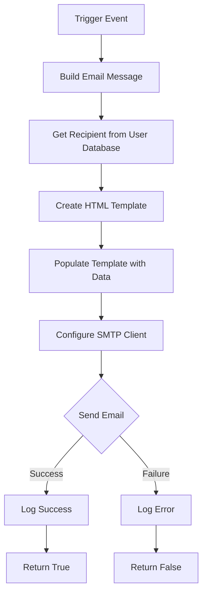

## Overview

SMAF implements a comprehensive email notification system using SMTP through Gmail's servers. The `clsMail.cs` class handles all email operations, sending notifications for expense report submissions, approvals, rejections, reimbursements, and administrative events.

## SMTP Configuration

The email system uses Gmail's SMTP server with TLS encryption:

```csharp
SmtpClient smtp = new SmtpClient();
smtp.Host = "smtp.gmail.com";
smtp.Port = 587;
smtp.UseDefaultCredentials = false;
smtp.Credentials = new System.Net.NetworkCredential(
    "inapesca.info@inapesca.gob.mx", 
    Dictionary.pass  // Password from configuration
);
smtp.EnableSsl = true;
```

### Email Configuration Parameters

| Parameter | Value | Description |
|-----------|-------|-------------|
| Host | smtp.gmail.com | Gmail SMTP server |
| Port | 587 | TLS/STARTTLS port |
| EnableSsl | true | Required for Gmail |
| From | inapesca.info@inapesca.gob.mx | System sender address |
| UseDefaultCredentials | false | Use custom credentials |

<Note>
The system password is stored securely in the `clsDictionary` class configuration. Never hardcode credentials in the source code.
</Note>

## Notification Triggers

### Expense Report Closure Notification

Sent to the validator when a user closes their expense report:

```csharp
public static Boolean Mail_Cierre_Comprobacion(Comision poComision, string psFolio)
{
    Boolean mail = false;
    SmtpClient smtp;
    string lsMail;
    string lsBody = "";
    
    MailMessage Correo4 = new MailMessage();
    Correo4.IsBodyHtml = true;
    Correo4.Priority = MailPriority.Normal;
    Correo4.From = new MailAddress("inapesca.info@inapesca.gob.mx");
    Correo4.Subject = "Notificacion por cierre de comprobación";
    
    // Get validator user data
    Usuario objUsuario4 = new Usuario();
    objUsuario4 = MngNegocioUsuarios.Obten_Datos(Dictionary.USUARIO_VALIDADOR, true);
    
    // Build notification message
    Entidades.Mail objMail = new Mail();
    objMail.Notificacion = "Estimad@ " + objUsuario4.Nombre + " " 
        + objUsuario4.ApPat + " " + objUsuario4.ApMat + ",";
    objMail.Notificacion += "se le notifica que el Usuario : <b>" 
        + MngNegocioUsuarios.Obtiene_Nombre(poComision.Comisionado) + " </b>";
    objMail.Notificacion += " <br> Acaba de cerrar la comprobacion de la comision con oficio numero :" 
        + poComision.Archivo;
    objMail.Notificacion += " <br> y se le ha asignado el siguiente número de folio: " + psFolio;
    
    // Send email
    // ... (email sending code)
}
```

### Reimbursement Notification

Sent when a user uploads reimbursement documentation:

```csharp
public static Boolean Mail_Reintegro(Comision poComision, string psImporte)
{
    Boolean mail = false;
    MailMessage Correo4 = new MailMessage();
    
    Correo4.IsBodyHtml = true;
    Correo4.Priority = MailPriority.Normal;
    Correo4.From = new MailAddress("inapesca.info@inapesca.gob.mx");
    Correo4.Subject = "Notificacion de Comprobación por reintegro";
    
    // Get reimbursement reviewer data
    Usuario objUsuario4 = new Usuario();
    objUsuario4 = MngNegocioUsuarios.Obten_Datos(Dictionary.USUARIO_REINTEGROS, true);
    
    // Build notification message
    Entidades.Mail objMail = new Mail();
    objMail.Notificacion = "Estimad@ " + objUsuario4.Nombre + " ,";
    objMail.Notificacion += "se le notifica que el Usuario : <b>" 
        + MngNegocioUsuarios.Obtiene_Nombre(poComision.Comisionado) + " </b>";
    objMail.Notificacion += " <br> Acaba de cargar el monto de un reintegro por " 
        + psImporte + ", para complementar la comprobacion de la comision con oficio numero :" 
        + poComision.Archivo;
    
    // Send email
    // ... (email sending code)
}
```

## Email Templates

### HTML Email Structure

All emails use responsive HTML templates with the INAPESCA branding:

```csharp
lsBody = "<!DOCTYPE html PUBLIC '-//W3C//DTD XHTML 1.0 Transitional//EN' 'http://www.w3.org/TR/xhtml1/DTD/xhtml1-transitional.dtd'>";
lsBody += "<html xmlns='http://www.w3.org/1999/xhtml'>";
lsBody += "<head>";
lsBody += "  <meta http-equiv='Content-Type' content='text/html; charset=UTF-8' />";
lsBody += "  <title>" + emailSubject + "</title>";
lsBody += "  <style type='text/css'>";
lsBody += "    body { margin: 0; padding: 0; font-family: Helvetica, Arial, sans-serif; }";
lsBody += "    #templateContainer { width: 600px; background-color: #F4F4F4; }";
lsBody += "    .headerContent { color: #505050; font-size: 20px; font-weight: bold; }";
lsBody += "    .bodyContent { color: #505050; font-size: 16px; line-height: 150%; }";
lsBody += "  </style>";
lsBody += "</head>";
lsBody += "<body>";
lsBody += "  <!-- Email content -->";
lsBody += "</body>";
lsBody += "</html>";
```

### Template Components

#### Header with Logo

```csharp
lsBody += "<table border='0' cellpadding='0' cellspacing='0' width='100%' id='templateHeader'>";
lsBody += "  <tr>";
lsBody += "    <td width='35%'></td>";
lsBody += "    <td valign='top' width='30%' class='headerContent'>";
lsBody += "      ";
lsBody += "    </td>";
lsBody += "    <td width='35%'></td>";
lsBody += "  </tr>";
lsBody += "</table>";
```

#### Body with Expense Report Details

```csharp
string psBody = "";
psBody += "<table id='tabla_datos' style='font-size: 12px; color: #007CA4; font-family: verdana;' ";
psBody += "       border='0' width='100%'>";

// Location
psBody += "<tr>";
psBody += "  <td>Lugar de la comision:</td>";
psBody += "  <td>" + poComision.Lugar + "</td>";
psBody += "</tr>";

// Dates
psBody += "<tr>";
psBody += "  <td>Fecha (s)</td>";
psBody += "  <td>";
if (poComision.Fecha_Inicio == poComision.Fecha_Final)
{
    psBody += poComision.Fecha_Inicio;
}
else
{
    psBody += "del " + poComision.Fecha_Inicio + " al " + poComision.Fecha_Final;
}
psBody += "  </td>";
psBody += "</tr>";

// Days
psBody += "<tr>";
psBody += "  <td>Dias de la comision</td>";
psBody += "  <td>" + poComision.Dias_Reales + "</td>";
psBody += "</tr>";

// Per diem amount
psBody += "<tr>";
psBody += "  <td>Total de Viaticos Otorgados</td>";
psBody += "  <td>$ " + clsFuncionesGral.Convert_Decimales(poComision.Total_Viaticos) + "</td>";
psBody += "</tr>";

// Fuel allowance
psBody += "<tr>";
psBody += "  <td>Total de Combustible Otorgado</td>";
psBody += "  <td>$ " + clsFuncionesGral.Convert_Decimales(poComision.Combustible_Autorizado) + "</td>";
psBody += "</tr>";

// Toll fees
psBody += "<tr>";
psBody += "  <td>Total de Peaje Otorgado</td>";
psBody += "  <td>$ " + clsFuncionesGral.Convert_Decimales(poComision.Peaje) + "</td>";
psBody += "</tr>";

// Transportation
psBody += "<tr>";
psBody += "  <td>Total de Pasaje Otrogado</td>";
psBody += "  <td>$ " + clsFuncionesGral.Convert_Decimales(poComision.Pasaje) + "</td>";
psBody += "</tr>";

// Suggestion
psBody += "<tr>";
psBody += "  <td colspan='2'>Se le sugiere revisar y validar comprobantes.</td>";
psBody += "</tr>";

psBody += "</table>";
```

#### Footer with Social Links

```csharp
lsBody += "<table border='0' cellpadding='0' cellspacing='0' width='100%' id='templateFooter'>";
lsBody += "  <tr>";
lsBody += "    <td align='center'>";
lsBody += "      <a href='https://www.facebook.com/INAPESCA-128465750669274/?fref=ts'>";
lsBody += "        ";
lsBody += "      </a>";
lsBody += "      <a href='https://twitter.com/inapescamx?lang=es'>";
lsBody += "        ";
lsBody += "      </a>";
lsBody += "      <a href='http://www.gob.mx/inapesca/'>";
lsBody += "        ";
lsBody += "      </a>";
lsBody += "    </td>";
lsBody += "  </tr>";
lsBody += "  <tr>";
lsBody += "    <td align='center'>";
lsBody += "      <em>Copyright &copy; Instituto Nacional de Pesca, All rights reserved.</em><br/>";
lsBody += "      Pitagoras 1320, Santa Cruz Atoyac, Ciudad de México. C.P. 03310";
lsBody += "    </td>";
lsBody += "  </tr>";
lsBody += "</table>";
```

## Recipient Management

### Single Recipient

```csharp
Correo4.To.Clear();
lsMail = objUsuario4.Email;
Correo4.To.Add(lsMail);
```

### Multiple Recipients (CC)

```csharp
try
{
    // Add CC recipient
    Correo4.CC.Add("jesus.canales@inapesca.gob.mx");
    smtp.Send(Correo4);
}
catch (Exception ex)
{
    // Handle error
    mail = false;
}
```

## Attachment Handling

The system supports attaching files to notifications:

```csharp
public static Stream GetStreamFile(string filePath)
{
    using (FileStream fileStream = File.OpenRead(filePath))
    {
        MemoryStream memStream = new MemoryStream();
        memStream.SetLength(fileStream.Length);
        fileStream.Read(memStream.GetBuffer(), 0, (int)fileStream.Length);
        return memStream;
    }
}

// Attach file to email
string attachmentPath = "path/to/document.pdf";
Attachment attachment = new Attachment(GetStreamFile(attachmentPath), "document.pdf");
Correo4.Attachments.Add(attachment);
```

## Workflow Notifications

### Notification Types

<Accordion title="Request Submitted">
  Sent to the immediate supervisor when an employee submits a travel request or expense report.
  
  **Recipients:** Direct supervisor, department head  
  **Trigger:** User clicks "Submit" on expense form  
  **Template:** Includes travel dates, destination, estimated costs
</Accordion>

<Accordion title="Request Approved">
  Sent to the employee when their request is approved.
  
  **Recipients:** Requesting employee  
  **Trigger:** Supervisor/reviewer approves request  
  **Template:** Includes approval details, authorized amounts
</Accordion>

<Accordion title="Request Rejected">
  Sent to the employee when their request is rejected.
  
  **Recipients:** Requesting employee  
  **Trigger:** Supervisor/reviewer rejects request  
  **Template:** Includes rejection reason, next steps
</Accordion>

<Accordion title="Expense Report Closed">
  Sent to the validator when an expense report is closed and ready for review.
  
  **Recipients:** Designated validator (Dictionary.USUARIO_VALIDADOR)  
  **Trigger:** User closes expense report  
  **Template:** Expense summary with all amounts
</Accordion>

<Accordion title="Reimbursement Uploaded">
  Sent to the reimbursement team when a user uploads reimbursement documentation.
  
  **Recipients:** Reimbursement officer (Dictionary.USUARIO_REINTEGROS)  
  **Trigger:** User uploads reimbursement scan  
  **Template:** Reimbursement amount, expense report reference
</Accordion>

## Email Sending Workflow



## Error Handling

```csharp
try
{
    smtp.Send(Correo4);
    
    // Clean up
    Correo4 = null;
    smtp = null;
    mail = true;
    objMail = null;
    objUsuario = null;
}
catch (Exception ex)
{
    // Log error (implement logging)
    // LogError("Email send failed: " + ex.Message);
    mail = false;
}

return mail;
```

### Common Email Errors

| Error | Cause | Solution |
|-------|-------|----------|
| Authentication Failed | Invalid credentials | Verify Gmail account password |
| SMTP Timeout | Network/firewall issue | Check port 587 is accessible |
| Invalid Recipient | User email not found | Validate user has email in database |
| Attachment Too Large | File exceeds size limit | Compress or split large files |

## Email Logging

All email operations should be logged for audit purposes:

```csharp
public static void LogEmail(
    string recipient, 
    string subject, 
    bool success, 
    string errorMessage = "")
{
    string Query = "INSERT INTO crip_email_log (";
    Query += " RECIPIENT, SUBJECT, FECHA, SUCCESS, ERROR_MESSAGE";
    Query += ") VALUES (";
    Query += " '" + recipient + "',";
    Query += " '" + subject + "',";
    Query += " NOW(),";
    Query += " " + (success ? "1" : "0") + ",";
    Query += " '" + errorMessage + "'";
    Query += ")";
    // Execute query...
}
```

<Warning>
Gmail has sending limits:
- 500 emails per day for standard Gmail accounts
- 2,000 emails per day for Google Workspace accounts

Monitor daily email volume to avoid hitting these limits.
</Warning>

## Best Practices

1. **HTML Formatting**: Always set `IsBodyHtml = true` for rich email content
2. **Priority**: Use `MailPriority.Normal` unless urgent (`MailPriority.High`)
3. **Character Encoding**: Use UTF-8 to support Spanish characters (á, é, í, ó, ú, ñ)
4. **Responsive Design**: Email templates are mobile-friendly with max-width constraints
5. **Unsubscribe**: System notifications don't require unsubscribe (transactional emails)
6. **Testing**: Test emails in multiple clients (Gmail, Outlook, Apple Mail)
7. **Cleanup**: Always dispose of `MailMessage` and `SmtpClient` objects after sending

## Security Considerations

1. **Credentials**: Store SMTP password in encrypted configuration, never in code
2. **SSL/TLS**: Always use `EnableSsl = true` for encrypted transmission
3. **Input Validation**: Sanitize all user input before including in email body
4. **Recipient Verification**: Validate email addresses exist before sending
5. **Rate Limiting**: Implement throttling to prevent email bombing

## Related Documentation

- [User Management](/technical/users/authentication) - User email configuration
- [Workflow Engine](/technical/workflows/approval-chain) - Approval workflow triggers
- [SAT Validation](/technical/integration/sat-validation) - Validation status notifications