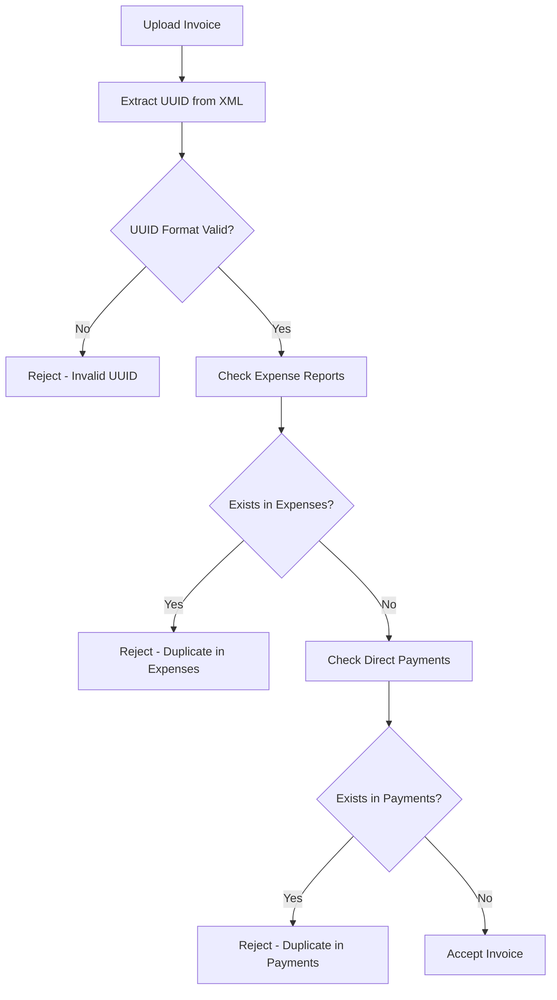

## Overview

SMAF implements comprehensive validation mechanisms to ensure all CFDI invoices comply with SAT (Servicio de Administración Tributaria) requirements. The system validates UUIDs, prevents duplicate submissions, verifies RFC formats, and ensures tax compliance.

## UUID Validation

The UUID (Universally Unique Identifier) is the fiscal folio assigned by the SAT's authorized certification provider (PAC). SMAF validates UUIDs to prevent fraud and duplicate submissions.

### UUID Structure

Valid UUIDs follow the RFC 4122 format:

```
12345678-1234-1234-1234-123456789012
```

### Duplicate Detection for Expense Reports

The system checks if a UUID has already been registered in the expense reporting system:

```csharp
public static string Exist_UUUID(string psUUID)
{
    string resultado = "";
    
    // Query the expense verification table
    string Query = "SELECT CLV_DOC FROM crip_comision_comprobacion ";
    Query += " WHERE CLV_DOC= '" + psUUID + "' AND ESTATUS IN ('1','5','7')";
    
    MySqlConnection ConexionMysql = MngConexion.getConexionMysql();
    MySqlCommand cmd = new MySqlCommand(Query, ConexionMysql);
    cmd.Connection.Open();
    MySqlDataReader Reader = cmd.ExecuteReader();
    
    if (Reader.Read())
    {
        // UUID already exists in the system
        resultado = Convert.ToString(Reader["CLV_DOC"]);
    }
    
    MngConexion.disposeConexionSMAF(ConexionMysql);
    return resultado;
}
```

### Duplicate Detection for Direct Payments

For direct ministry payments (ministraciones), a separate validation ensures UUIDs aren't reused:

```csharp
public static string Exist_UUUID_Ministracion(string psUUID)
{
    string resultado = "";
    
    string Query = "SELECT DOCUMENTO AS DOCUMENTO ";
    Query += "FROM crip_ministracion";
    Query += " WHERE DOCUMENTO = '" + psUUID + "'";
    Query += " AND ESTATUS != '0'";
    
    MySqlConnection ConexionMysql = MngConexion.getConexionMysql();
    MySqlCommand cmd = new MySqlCommand(Query, ConexionMysql);
    cmd.Connection.Open();
    MySqlDataReader Reader = cmd.ExecuteReader();
    
    if (Reader.Read())
    {
        resultado = Convert.ToString(Reader["DOCUMENTO"]);
    }
    
    MngConexion.disposeConexionSMAF(ConexionMysql);
    return resultado;
}
```

### Validation Flow



## RFC Validation

RFC (Registro Federal de Contribuyentes) is the Mexican tax identification number. SMAF validates RFC formats for both individuals and legal entities.

### RFC Format Rules

**Legal Entities (Personas Morales):**
- 12 characters
- Format: `AAA010101ABC`
- First 3 characters: Alphabetic (company initials)
- Next 6 characters: Date (YYMMDD)
- Last 3 characters: Alphanumeric (homoclave)

**Individuals (Personas Físicas):**
- 13 characters  
- Format: `AAAA010101ABC`
- First 4 characters: Alphabetic (name initials)
- Next 6 characters: Date (YYMMDD)
- Last 3 characters: Alphanumeric (homoclave)

### RFC Extraction

RFC values are extracted from both issuer and receiver data:

```csharp
// Extract issuer RFC
poXml.RFC_EMISOR = factura.Emisor.Rfc;

// Extract receiver RFC
poXml.RFC_RECEPTOR = factura.Receptor.Rfc;
```

### RFC Storage in Database

The system stores RFC data in multiple tables:

```csharp
public static bool Inserta_DetalleXML(
    string psUsuario, 
    string psUbicacion,
    string psDocumento, 
    string psXml,
    string psTimbreFiscal,
    string psProvedor,  // RFC of provider
    string psConcepto,
    string psPartida,
    // ... additional parameters
)
{
    string Query = "INSERT INTO crip_xml_detalle (";
    Query += " UUID,";
    Query += " RFC,";  // Provider's RFC
    // ... other fields
    
    Query += " VALUES (";
    Query += " '" + psTimbreFiscal + "',";  // UUID
    Query += " '" + psProvedor + "',";      // RFC
    // ... other values
}
```

## Invoice Verification Process

The complete invoice verification workflow ensures compliance at multiple levels:

### Step 1: XML Structure Validation

```csharp
try
{
    XmlSerializer serializer = new XmlSerializer(typeof(Comprobante));
    XmlTextReader reader = new XmlTextReader(psArchivo);
    Comprobante factura = (Comprobante)serializer.Deserialize(reader);
}
catch (Exception ex)
{
    // Invalid XML structure - reject invoice
    return false;
}
```

### Step 2: Timbre Fiscal Digital Validation

Ensure the invoice has a valid digital tax stamp:

```csharp
foreach (ComprobanteComplemento r in factura.Complemento)
{
    for (int y = 0; y < r.Any.Length; y++)
    {
        for (int contador = 0; contador < r.Any[y].Attributes.Count; contador++)
        {
            if (r.Any[y].Attributes[contador].Name == "UUID")
            {
                string uuid = r.Any[y].Attributes["UUID"].Value;
                
                if (string.IsNullOrEmpty(uuid))
                {
                    // No UUID found - reject
                    return false;
                }
                
                // Check for duplicates
                if (!string.IsNullOrEmpty(Exist_UUUID(uuid)))
                {
                    // Duplicate UUID - reject
                    return false;
                }
            }
        }
    }
}
```

### Step 3: Tax Calculation Verification

Validate that tax calculations are correct:

```csharp
// Verify tax totals match individual tax items
if (factura.Impuestos != null)
{
    decimal totalTraslados = 0;
    
    if (factura.Impuestos.Traslados != null)
    {
        foreach (ComprobanteImpuestosTraslado im in factura.Impuestos.Traslados)
        {
            totalTraslados += im.Importe;
        }
    }
    
    // Verify total matches
    if (Math.Abs(totalTraslados - factura.Impuestos.TotalImpuestosTrasladados) > 0.01m)
    {
        // Tax calculation mismatch - flag for review
        logWarning("Tax calculation discrepancy detected");
    }
}
```

### Step 4: Amount Verification

Ensure the total equals subtotal plus taxes:

```csharp
// Calculate expected total
decimal expectedTotal = factura.SubTotal 
    - (factura.DescuentoSpecified ? factura.Descuento : 0)
    + (factura.Impuestos?.TotalImpuestosTrasladados ?? 0)
    - (factura.Impuestos?.TotalImpuestosRetenidos ?? 0);

// Verify against declared total (allow 1 cent tolerance for rounding)
if (Math.Abs(expectedTotal - factura.Total) > 0.01m)
{
    // Total calculation error - reject
    return false;
}
```

## Tax Compliance Checks

### Supported Tax Types

SMAF validates the following tax types:

<Accordion title="IVA (Impuesto al Valor Agregado) - VAT">
  - Tax code: `002`
  - Standard rate: 16%
  - Border rate: 8%
  - Exempt: 0%
</Accordion>

<Accordion title="ISR (Impuesto Sobre la Renta) - Income Tax">
  - Tax code: `001`
  - Applied as withholding (retención)
  - Variable rates depending on service type
</Accordion>

<Accordion title="IEPS (Impuesto Especial sobre Producción y Servicios)">
  - Tax code: `003`
  - Special excise tax on specific goods and services
  - Rates vary by product category
</Accordion>

### Tax Code Mapping

The system supports both legacy and current SAT tax codes:

```csharp
switch (im.Impuesto.ToString())
{
    case "IVA":   // Legacy code
    case "002":   // Current SAT code
        poXml.IVA = Convert_Decimales(im.Importe.ToString());
        break;
        
    case "ISR":   // Legacy code
    case "001":   // Current SAT code
        poXml.ISR = Convert_Decimales(im.Importe.ToString());
        break;
        
    case "IEPS":  // Legacy code
    case "003":   // Current SAT code
        poXml.IEPS = Convert_Decimales(im.Importe.ToString());
        break;
}
```

## Validation Status Tracking

Invoices are assigned status codes throughout the validation process:

| Status | Description |
|--------|-------------|
| 0 | Deleted/Cancelled |
| 1 | Active - Pending Review |
| 5 | Validated - Approved |
| 7 | Validated - In Process |

```csharp
public static string Exist_UUUID(string psUUID)
{
    // Only check active and validated invoices
    string Query = "SELECT CLV_DOC FROM crip_comision_comprobacion ";
    Query += " WHERE CLV_DOC= '" + psUUID + "' AND ESTATUS IN ('1','5','7')";
    // ...
}
```

## Error Handling

### Common Validation Errors

```csharp
public enum ValidationError
{
    InvalidXMLFormat,
    MissingTimbreFiscal,
    DuplicateUUID,
    InvalidRFC,
    TaxCalculationError,
    AmountMismatch,
    UnsupportedVersion
}

public class ValidationResult
{
    public bool IsValid { get; set; }
    public ValidationError? Error { get; set; }
    public string ErrorMessage { get; set; }
    public string UUID { get; set; }
}
```

### Validation Response Examples

**Successful Validation:**
```json
{
  "isValid": true,
  "uuid": "12345678-1234-1234-1234-123456789012",
  "message": "Invoice validated successfully"
}
```

**Duplicate UUID Error:**
```json
{
  "isValid": false,
  "error": "DuplicateUUID",
  "message": "UUID 12345678-1234-1234-1234-123456789012 already exists in the system",
  "existingDocument": "COMP-2026-001234"
}
```

<Note>
All UUID validations are case-insensitive to prevent duplicate entries with different casing.
</Note>

<Warning>
Invoices with validation errors are automatically flagged for manual review by the validation team. They cannot be processed for payment until errors are resolved.
</Warning>

## Audit Trail

All validation attempts are logged for audit purposes:

```csharp
public static void LogValidation(
    string uuid, 
    string usuario, 
    bool isValid, 
    string errorMessage = "")
{
    string Query = "INSERT INTO crip_validation_log (";
    Query += " UUID, USUARIO, FECHA, IS_VALID, ERROR_MESSAGE";
    Query += ") VALUES (";
    Query += " '" + uuid + "',";
    Query += " '" + usuario + "',";
    Query += " NOW(),";
    Query += " " + (isValid ? "1" : "0") + ",";
    Query += " '" + errorMessage + "'";
    Query += ")";
    // Execute query...
}
```

## Best Practices

1. **Early Validation**: Validate UUIDs immediately upon file upload before processing other data
2. **Cross-System Checks**: Always check both expense reports and direct payment systems for duplicates
3. **Tax Code Support**: Support both legacy text codes and current numeric SAT codes
4. **Tolerance for Rounding**: Allow 1-cent tolerance in amount calculations due to rounding differences
5. **Audit Logging**: Log all validation attempts with timestamps and user information
6. **Error Messages**: Provide clear, actionable error messages to users

## Related Documentation

- [CFDI XML Processing](/technical/integration/cfdi-xml) - XML parsing and data extraction
- [Email Notifications](/technical/integration/email-notifications) - Validation status notifications
- [Database Schema](/technical/database/schema) - Validation data storage