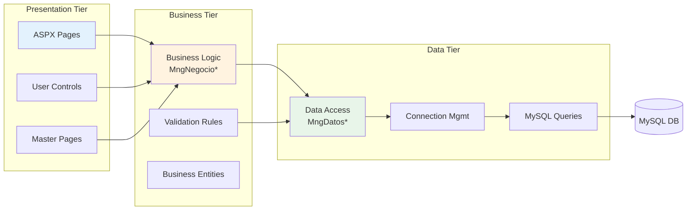
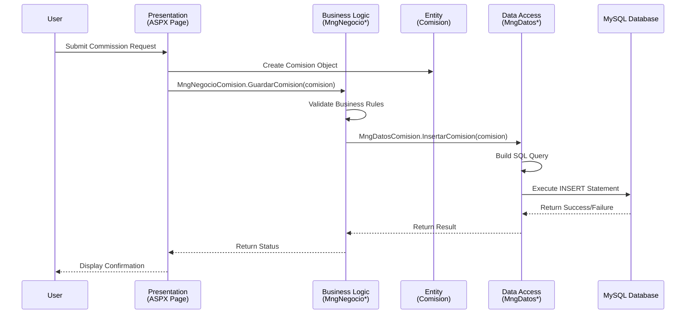

## Architecture Overview

SMAF implements a classic **Three-Tier Architecture** pattern, separating the application into three distinct logical layers. This architectural approach provides modularity, maintainability, and clear separation of concerns.



## Layer 1: Presentation Layer (InapescaWeb)

### Project Structure

The presentation layer is organized into functional modules:

<Tabs>
  <Tab title="Solicitudes">
    **Request Management**
    
    - `Solicitud_Comision.aspx` - Travel commission requests
    - `SolicitudPSP.aspx` - Special program requests
    
    These pages handle user input for creating and submitting travel allowance requests.
  </Tab>
  
  <Tab title="Autorizaciones">
    **Authorization Workflow**
    
    - `Comision_Aut.aspx` - Commission authorization interface
    
    Handles the approval workflow for submitted requests.
  </Tab>
  
  <Tab title="Comprobaciones">
    **Expense Documentation**
    
    - `Comprobacion2017.aspx`, `Comprobacion2018.aspx` - Annual expense forms
    - `ComprobacionAdmin.aspx` - Administrative expense tracking
    - `ComprobacionViaticosInternacionales.aspx` - International travel expenses
    - `ComprobacionSInXml.aspx` - Non-XML voucher submission
    - `Comision_Comprobacion.aspx` - Commission expense verification
  </Tab>
  
  <Tab title="Pagos">
    **Payment Processing**
    
    - `Pagos.aspx` - General payment processing
    - `PagaViaticos.aspx` - Travel allowance disbursement
    - `Pagos_Viaticos.aspx` - Travel payment management
  </Tab>
</Tabs>

### Key Components

#### 1. ASPX Pages

ASP.NET Web Forms that render the user interface:

```csharp Comision_Aut.aspx.cs (example structure)
public partial class Comision_Aut : System.Web.UI.Page
{
    protected void Page_Load(object sender, EventArgs e)
    {
        // Page initialization
    }
    
    protected void btnAutorizar_Click(object sender, EventArgs e)
    {
        // Business layer call
        MngNegocioComision.AutorizarComision(...);
    }
}
```

#### 2. Utility Classes

The presentation layer includes helper classes:

- `clsFuncionesGral.cs` - General utility functions
- `clsPdf.cs` - PDF generation utilities
- `clsMenu.cs` - Menu structure management
- `clsTreeview.cs` - Hierarchical data display

#### 3. Project References

```xml InapescaWeb.csproj:700-707
<ProjectReference Include="..\InapescaWeb.BRL\InapescaWeb.BRL.csproj">
  <Project>{9E452915-86A4-4499-B7C6-EDB42B6FF5EE}</Project>
  <Name>InapescaWeb.BRL</Name>
</ProjectReference>
<ProjectReference Include="..\InapescaWeb.DAL\InapescaWeb.DAL.csproj">
  <Project>{1211AE21-A6A2-42F4-A400-BCC288C0D4A9}</Project>
  <Name>InapescaWeb.DAL</Name>
</ProjectReference>
```

<Note>
  The presentation layer references both the Business Logic Layer (BRL) and Data Access Layer (DAL), though best practice would be to only reference BRL.
</Note>

## Layer 2: Business Logic Layer (InapescaWeb.BRL)

### Project Structure

The BRL contains business rule classes following a consistent naming pattern: `MngNegocio*`

<CodeGroup>
```xml InapescaWeb.BRL.csproj:42-93
<Compile Include="MngNegocioActividades.cs" />
<Compile Include="MngNegocioActualizaDatos.cs" />
<Compile Include="MngNegocioAdscripcion.cs" />
<Compile Include="MngNegocioAnio.cs" />
<Compile Include="MngNegocioComision.cs" />
<Compile Include="MngNegocioComisionDetalle.cs" />
<Compile Include="MngNegocioComisionExtraordinaria.cs" />
<Compile Include="MngNegocioComponente.cs" />
<Compile Include="MngNegocioComprobacion.cs" />
<Compile Include="MngNegocioConfiguraciones.cs" />
<Compile Include="MngNegocioContrato.cs" />
<Compile Include="MngNegocioCuentas.cs" />
<Compile Include="MngNegocioDependencia.cs" />
<Compile Include="MngNegocioDirecciones.cs" />
<Compile Include="MngNegocioEncriptacion.cs" />
<Compile Include="MngNegocioEncriptacionDGAIPP.cs" />
```
</CodeGroup>

### Business Logic Classes

Each class handles a specific business domain:

<CardGroup cols={3}>
  <Card title="MngNegocioComision" icon="plane-departure">
    Commission/travel request business logic
  </Card>
  <Card title="MngNegocioComprobacion" icon="file-invoice-dollar">
    Expense verification and validation
  </Card>
  <Card title="MngNegocioPago" icon="money-bill-transfer">
    Payment processing and disbursement
  </Card>
  <Card title="MngNegocioMinistracion" icon="hand-holding-dollar">
    Budget allocation logic
  </Card>
  <Card title="MngNegocioProyecto" icon="diagram-project">
    Project management rules
  </Card>
  <Card title="MngNegocioUsuarios" icon="users">
    User management and authentication
  </Card>
  <Card title="MngNegocioViaticos" icon="suitcase">
    Travel allowance calculations
  </Card>
  <Card title="MngNegocioPartidas" icon="list-check">
    Budget line item management
  </Card>
  <Card title="MngNegocioReportesViaticos" icon="chart-line">
    Travel expense reporting
  </Card>
</CardGroup>

### Example: Commission Business Logic

```csharp MngNegocioComision.cs:32-35
public static ComisionProyecto RegresaDatos(string pPeriodo, string pClave, string pDependencia)
{
    return MngDatosComision.RegresaDatos(pPeriodo, pClave, pDependencia);
}
```

```csharp MngNegocioComision.cs:77-80
public static Comision DetalleComision_Pagos(string psFolio, string psDep, 
                                              string psComisionado = "", 
                                              bool psUsuarioPagador = false)
{
    return MngDatosComision.DetalleComision_Pagos(psFolio, psDep, 
                                                    psComisionado, psUsuarioPagador);
}
```

### Layer Dependencies

```xml InapescaWeb.BRL.csproj:96-104
<ProjectReference Include="..\InapescaWeb.DAL\InapescaWeb.DAL.csproj">
  <Project>{1211AE21-A6A2-42F4-A400-BCC288C0D4A9}</Project>
  <Name>InapescaWeb.DAL</Name>
</ProjectReference>
<ProjectReference Include="..\InapescaWeb.Entidades\InapescaWeb.Entidades.csproj">
  <Project>{6B711C7C-3272-43FC-BB0C-A99E644DF90B}</Project>
  <Name>InapescaWeb.Entidades</Name>
</ProjectReference>
```

<Info>
  The BRL references both the Data Access Layer (DAL) and Entity Layer (Entidades), providing business logic orchestration between data operations and entity models.
</Info>

## Layer 3: Data Access Layer (InapescaWeb.DAL)

### Project Structure

The DAL contains data access classes following the pattern: `MngDatos*`

```xml InapescaWeb.DAL.csproj:47-103
<Compile Include="clsDictionary.cs" />
<Compile Include="clsFunciones.cs" />
<Compile Include="MngDatosComision.cs" />
<Compile Include="MngDatosConfiguraciones.cs" />
<Compile Include="MngDatosContrato.cs" />
<Compile Include="MngDatosCuentasBancarias.cs" />
<Compile Include="MngDatosDgaipp.cs" />
<Compile Include="MngConexion.cs" />
```

### Core Components

#### 1. Connection Manager

Centralized database connection management:

```csharp MngConexion.cs:28-40
public class MngConexion
{
    public static MySqlConnection ConexionMysql;
    
    public static MySqlConnection getConexionMysql()
    {
        string CadenaConexionEncriptada = ConfigurationManager.AppSettings["localhost"];
        string CadenaConexion = MngEncriptacion.decripString(CadenaConexionEncriptada);
        ConexionMysql = new MySqlConnection(CadenaConexion);
        return ConexionMysql;
    }
    
    public static void disposeConexion()
    {
        ConexionMysql.Close();
        ConexionMysql.Dispose();
    }
}
```

<Warning>
  The connection strings are encrypted using the `MngEncriptacion` class before being stored in `web.config`.
</Warning>

#### 2. Data Access Classes

Each class handles CRUD operations for specific entities:

```csharp MngDatosComision.cs:39-61
public static ComisionProyecto RegresaDatos(string pPeriodo, string pClave, string pDependencia)
{
    string Query = "";
    Query += "SELECT SUM(COMBUST_EFECTIVO) AS COMBUSTIBLE, SUM(PEAJE) AS PEAJE, ";
    Query += "SUM(PASAJE) AS PASAJE, SUM(SINGLADURAS) AS SINGLADURAS, ";
    Query += "SUM(TOTAL_VIATICOS) AS TOTAL_VIATICOS, ";
    Query += "SUM(COMBUST_EFECTIVO) + SUM(PEAJE) + SUM(PASAJE) + ";
    Query += "SUM(SINGLADURAS) + SUM(TOTAL_VIATICOS) AS GRANTOTAL ";
    Query += "FROM crip_comision ";
    Query += "WHERE PERIODO='" + pPeriodo + "' ";
    Query += "AND CLV_PROY='" + pClave + "' ";
    Query += "AND CLV_DEP_PROY='" + pDependencia + "'";
    
    MySqlConnection ConexionMysql = MngConexion.getConexionMysql();
    MySqlCommand cmd = new MySqlCommand(Query, ConexionMysql);
    cmd.Connection.Open();
    MySqlDataReader Reader = cmd.ExecuteReader();
    
    ComisionProyecto oComision = new ComisionProyecto();
    while (Reader.Read())
    {
        oComision.Combustible = Convert.ToString(Reader["COMBUSTIBLE"]);
        oComision.Peaje = Convert.ToString(Reader["PEAJE"]);
        // ... map other fields
    }
    
    Reader.Close();
    MngConexion.disposeConexionSMAF(ConexionMysql);
    return oComision;
}
```

#### 3. Database Provider

```xml InapescaWeb.DAL.csproj:34-37
<Reference Include="MySql.Data, Version=6.6.5.0, Culture=neutral, 
                   PublicKeyToken=c5687fc88969c44d, processorArchitecture=MSIL">
  <HintPath>bin\Release\MySql.Data.dll</HintPath>
</Reference>
```

## Entity Layer (InapescaWeb.Entidades)

The entity layer defines business objects used across all tiers:

### Entity Classes

<Tabs>
  <Tab title="Core Entities">
    ```xml InapescaWeb.Entidades.csproj:43-87
    <Compile Include="Comision.cs" />
    <Compile Include="ComisionDetalle.cs" />
    <Compile Include="ComisionProyecto.cs" />
    <Compile Include="Comision_Extraordinaria.cs" />
    <Compile Include="comprobacion.cs" />
    <Compile Include="Proyecto.cs" />
    <Compile Include="Usuario.cs" />
    <Compile Include="Partidas.cs" />
    <Compile Include="Pagos.cs" />
    <Compile Include="Ministracion.cs" />
    ```
  </Tab>
  
  <Tab title="Supporting Entities">
    ```xml
    <Compile Include="CuentasBancarias.cs" />
    <Compile Include="Entidad.cs" />
    <Compile Include="Excel.cs" />
    <Compile Include="GenerarRef.cs" />
    <Compile Include="Itinerario.cs" />
    <Compile Include="Login.cs" />
    <Compile Include="Mail.cs" />
    <Compile Include="Reporte.cs" />
    <Compile Include="Transporte.cs" />
    <Compile Include="Ubicacion.cs" />
    ```
  </Tab>
  
  <Tab title="XML & Transparency">
    ```xml
    <Compile Include="cfdiv33.cs" />
    <Compile Include="cfdv4.cs" />
    <Compile Include="Xml.cs" />
    <Compile Include="Transparencia.cs" />
    <Compile Include="Transparencia_Partidas.cs" />
    <Compile Include="Transparencia_Vinculos.cs" />
    ```
  </Tab>
</Tabs>

### Example Entity: Comision

```csharp Comision.cs:25-100
public class Comision
{
    private string lsFolio;
    private string lsFechaSol;
    private string lsfechaRespP;
    private string lsFechaVobo;
    private string lsFechaAut;
    private string lsUsuSol;
    private string lsUbicacion;
    private string lsArea;
    private string lsProyecto;
    private string lsDepProy;
    private string lsLugar;
    private string lsCapitulo;
    private string lsProceso;
    private string lsIndicador;
    private string lsPartPre;
    private string lsFechaI;
    private string lsFechaF;
    private string lsDiasT;
    private string lsDiasR;
    private string lsObjetivo;
    // ... additional fields
    
    // Public properties with getters/setters
    public string Folio { get; set; }
    public string FechaSolicitud { get; set; }
    // ...
}
```

## Data Flow

The following diagram illustrates a typical request flow through all layers:



## Layer Communication Patterns

### 1. Presentation to Business Layer

```csharp
// ASPX Page calls business layer
protected void btnGuardar_Click(object sender, EventArgs e)
{
    Comision comision = new Comision();
    comision.Folio = txtFolio.Text;
    comision.Objetivo = txtObjetivo.Text;
    // ... set other properties
    
    bool resultado = MngNegocioComision.GuardarComision(comision);
    
    if (resultado)
        MostrarMensaje("Guardado exitoso");
}
```

### 2. Business to Data Layer

```csharp
// Business layer delegates to data layer
public static bool GuardarComision(Comision comision)
{
    // Business validation
    if (!ValidarFechas(comision)) return false;
    
    // Delegate to data layer
    return MngDatosComision.InsertarComision(comision);
}
```

### 3. Data Layer to Database

```csharp
// Data layer executes SQL
public static bool InsertarComision(Comision comision)
{
    MySqlConnection conn = MngConexion.getConexionMysql();
    string query = "INSERT INTO crip_comision VALUES (...)";
    MySqlCommand cmd = new MySqlCommand(query, conn);
    
    conn.Open();
    int result = cmd.ExecuteNonQuery();
    MngConexion.disposeConexion();
    
    return result > 0;
}
```

## Benefits of This Architecture

<AccordionGroup>
  <Accordion title="Separation of Concerns">
    Each layer has a distinct responsibility:
    - **Presentation**: UI rendering and user interaction
    - **Business**: Rules, validation, and workflow
    - **Data**: Database operations and persistence
  </Accordion>
  
  <Accordion title="Maintainability">
    Changes to one layer have minimal impact on others. For example:
    - UI redesign doesn't affect business logic
    - Business rule changes don't require database modifications
    - Database optimizations are isolated to the DAL
  </Accordion>
  
  <Accordion title="Testability">
    Each layer can be tested independently:
    - Business logic can be unit tested without UI
    - Data access can be tested with mock databases
    - Integration testing validates layer interactions
  </Accordion>
  
  <Accordion title="Reusability">
    Business logic and data access components can be reused:
    - Same business rules for web and potential API
    - Shared entity classes across all layers
    - Common data access methods for similar operations
  </Accordion>
</AccordionGroup>

## Best Practices Observed

<Check>**Consistent Naming Conventions**: `MngNegocio*` for business logic, `MngDatos*` for data access</Check>
<Check>**Entity Usage**: Shared entity objects across all layers</Check>
<Check>**Connection Management**: Centralized through `MngConexion` class</Check>
<Check>**Security**: Encrypted connection strings</Check>

## Areas for Improvement

<Warning>
  Some areas that could be enhanced:
  
  - **Presentation Layer Dependencies**: Currently references both BRL and DAL; should only reference BRL
  - **SQL Injection Risk**: Direct string concatenation in queries; should use parameterized queries
  - **Exception Handling**: Could benefit from more structured error handling
  - **Repository Pattern**: Could abstract data access further with repository interfaces
</Warning>

## Related Documentation

<CardGroup cols={2}>
  <Card title="Architecture Overview" icon="sitemap" href="/technical/architecture-overview">
    High-level system architecture
  </Card>
  
  <Card title="Database Schema" icon="database" href="/technical/database-schema">
    MySQL database structure and relationships
  </Card>
</CardGroup>