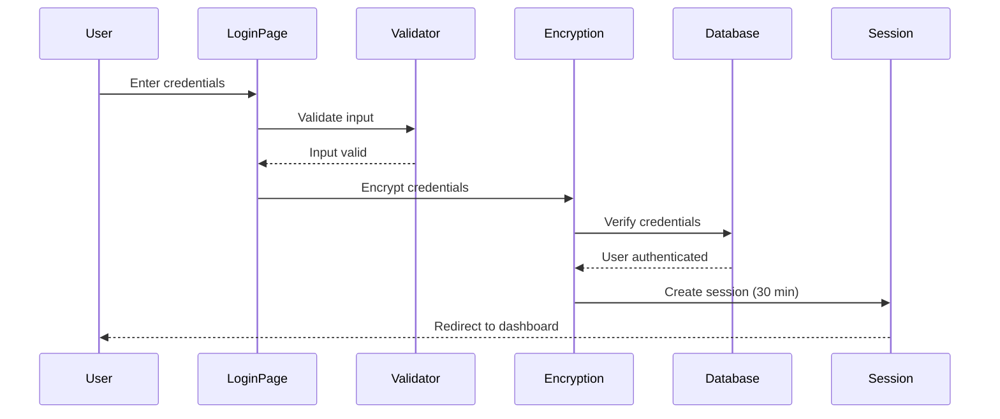

# Authentication

SMAF implements a secure authentication system to protect sensitive expense and travel allowance data for the Mexican Federal Public Administration.

## Login Process

The authentication workflow follows these steps:

<Steps>
  <Step title="Access the Login Page">
    Navigate to the SMAF login page where you'll see the INAPESCA branding and the application title: "Aplicativo de Control Interno de Viáticos (SMAF - WEB)"
  </Step>
  
  <Step title="Enter Your Credentials">
    Provide your username and password in the designated fields. All usernames are automatically converted to uppercase.
    
    <Note>
      Both username and password fields are required and cannot be left empty.
    </Note>
  </Step>
  
  <Step title="Input Validation">
    The system validates your input before processing. SQL injection and malicious character patterns are blocked.
    
    <Warning>
      If you enter invalid characters, you'll see an error: "Esta insertando un caracter o cadena invalida en el Usuario/Password"
    </Warning>
  </Step>
  
  <Step title="Credential Encryption">
    Your credentials are encrypted using Rijndael (AES) encryption before being sent to the server.
    
    ```csharp Index.aspx.cs
    objLogin.Usuario = MngEncriptacion.encryptString(
        clsFuncionesGral.ConvertMayus(txtUsuario.Text)
    );
    objLogin.Password = MngEncriptacion.encryptString(
        clsFuncionesGral.ConvertMayus(txtPassword.Text)
    );
    ```
  </Step>
  
  <Step title="Authentication Verification">
    The system validates your encrypted credentials against the database through the `MngNegocioLogin.Acceso_Smaf()` method.
  </Step>
  
  <Step title="Session Establishment">
    Upon successful authentication, a 30-minute session is created with all your user information stored securely.
    
    ```csharp Index.aspx.cs
    Session.Timeout = 30;
    Session["Crip_Usuario"] = oUsuario.Usser;
    Session["Crip_Nivel"] = oUsuario.Nivel;
    Session["Crip_Rol"] = oUsuario.Rol;
    // ... additional session data
    ```
  </Step>
  
  <Step title="Redirect to Dashboard">
    You're automatically redirected to the Home dashboard at `Home/Home.aspx`
  </Step>
</Steps>

## Security Features

### Input Validation

SMAF employs regular expression validation to prevent SQL injection attacks and malicious input:

```csharp Index.aspx.cs
if (!clsFuncionesGral.Exp_Regular(txtUsuario.Text))
{
    if (!clsFuncionesGral.Exp_Regular(txtPassword.Text))
    {
        // Proceed with authentication
    }
    else 
    {
        // Show password validation error
    }
}
```

The validation blocks potentially dangerous patterns including:
- SQL commands (SELECT, DROP, INSERT, UPDATE, DELETE, etc.)
- Special characters that could be used in injection attacks
- Script tags and malicious code patterns

### Encryption

All credentials are encrypted using **Rijndael (AES) encryption** before transmission and storage:

```csharp MngEncriptacion.cs
public static string encryptString(string cadena)
{
    byte[] inputBytes = Encoding.ASCII.GetBytes(cadena);
    RijndaelManaged cripto = new RijndaelManaged();
    
    using (CryptoStream objCryptoStream = new CryptoStream(
        ms, cripto.CreateEncryptor(_key, _iv), CryptoStreamMode.Write))
    {
        objCryptoStream.Write(inputBytes, 0, inputBytes.Length);
        objCryptoStream.FlushFinalBlock();
    }
    
    return Convert.ToBase64String(encripted);
}
```

<Note>
  The encryption keys are stored securely in the `MngEncriptacion` class and use industry-standard AES encryption.
</Note>

### Session Management

SMAF implements comprehensive session management to maintain security:

#### Session Timeout

- **Duration**: 30 minutes of inactivity
- **Locale**: Set to LCID 2057 (UK English format)
- **Version Tracking**: Session includes application version for compatibility

```csharp Index.aspx.cs
Session.Timeout = 30;
Session.LCID = 2057;
Session["Version"] = "1.0";
```

#### Session Data

The following encrypted user information is stored in the session:

- `Crip_Usuario` - User identifier
- `Crip_Password` - Encrypted password
- `Crip_Nivel` - User level
- `Crip_Plaza` - Position code
- `Crip_Puesto` - Job title
- `Crip_Secretaria` - Department/Secretariat
- `Crip_Organismo` - Organization
- `Crip_Ubicacion` - Location/Office assignment
- `Crip_Area` - Area
- `Crip_Nombre` - First name
- `Crip_ApPat` - Paternal surname
- `Crip_ApMat` - Maternal surname
- `Crip_RFC` - Tax ID (RFC)
- `Crip_Cargo` - Position/Role
- `Crip_Email` - Email address
- `Crip_Rol` - Role identifier (determines menu access)
- `Crip_Abreviatura` - Abbreviation

#### Session Validation

Every page checks for session timeout before loading:

```csharp Home.aspx.cs
if (!clsFuncionesGral.IsSessionTimedOut())
{
    // Load page content
}
else
{
    Response.Redirect("../Index.aspx", true);
}
```

The `IsSessionTimedOut()` method verifies:
1. Session exists
2. Session is not a new session
3. Session cookie is valid

## Authentication Errors

### Invalid Credentials

If authentication fails, you'll see:

```
Error de autenticacion, intente de nuevo
```

### Invalid Characters

Attempting to use forbidden characters triggers specific warnings:

- **Username**: "Esta insertando un caracter o cadena invalida en el Usuario"
- **Password**: "Esta insertando un caracter o cadena invalida en el Password"

### Session Expired

When your session expires after 30 minutes of inactivity, you're automatically redirected to the login page.

<Tip>
  Keep your session active by regularly interacting with the application. If you need to step away, consider logging out to secure your account.
</Tip>

## Best Practices

<CardGroup cols={2}>
  <Card title="Use Strong Passwords" icon="lock">
    Choose passwords that combine letters, numbers, and special characters
  </Card>
  
  <Card title="Never Share Credentials" icon="user-shield">
    Your login credentials are personal and should never be shared with colleagues
  </Card>
  
  <Card title="Log Out When Done" icon="right-from-bracket">
    Always log out when finishing your work, especially on shared computers
  </Card>
  
  <Card title="Report Suspicious Activity" icon="triangle-exclamation">
    Contact your system administrator if you notice any unusual account activity
  </Card>
</CardGroup>

## Technical Reference

### Authentication Flow



### Source Code References

- **Login Page**: `Index.aspx` and `Index.aspx.cs`
- **Encryption**: `MngEncriptacion.cs`
- **Session Validation**: `clsFuncionesGral.cs:42-70`
- **Authentication Logic**: `Index.aspx.cs:65-111`