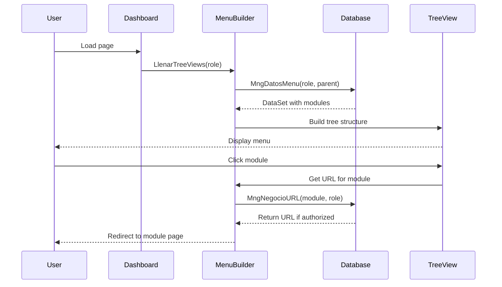

# Navigation

SMAF uses a hierarchical, role-based navigation system that presents users with only the modules and features they have permission to access. This guide explains how the menu system works and how to navigate effectively.

## Main Menu Structure

The navigation menu is implemented as a TreeView control that displays a collapsible hierarchy of modules and features.

### TreeView Implementation

```html Home.aspx
<div id="side-a">
    <asp:TreeView ID="tvMenu" runat="server" 
                  ShowCheckBoxes="None" 
                  ShowLines="false" 
                  onselectednodechanged="tvMenu_SelectedNodeChanged">
    </asp:TreeView>
</div>
```

The menu is populated dynamically based on your role when the dashboard loads:

```csharp Home.aspx.cs
clsFuncionesGral.LlenarTreeViews(
    Dictionary.NUMERO_CERO,    // Start from root (parent = 0)
    tvMenu,                    // TreeView control
    false,                     // Not for partidas (budget items)
    "Menu",                    // Type: Menu
    "SMAF",                    // Application: SMAF
    Session["Crip_Rol"].ToString()  // User's role
);
```

<Note>
  The menu starts from the root level (parent = 0) and recursively builds the tree structure based on parent-child relationships in the database.
</Note>

## Module Organization

Modules are organized hierarchically with parent and child relationships:

### Data Structure

Each menu item contains:

- **PADRE** (Parent): The parent module ID ("0" for root items)
- **MODULO**: Unique module identifier
- **DESCRIPCION**: Display name of the module
- **URL**: Target page for the module
- **ROL**: Required role to access the module

### Menu Building Process

```csharp clsFuncionesGral.cs
public static void LlenarTreeViews(
    string psPadre, 
    TreeView ptvObject, 
    Boolean psBandera, 
    string psTipo, 
    string psAplicativo, 
    string psRol = ""
)
{
    int i = 0;
    
    switch (psAplicativo)
    {
        case "SMAF":
            switch (psTipo)
            {
                case "Menu":
                    // Retrieve menu data from database
                    datasetArbol = MngNegocioMenu.MngDatosMenu(psRol, psPadre);
                    tblTabla = new DataTable();
                    tblTabla = datasetArbol.Tables["DataSetArbol"];
                    break;
                    
                case "Partidas":
                    // Retrieve budget items
                    datasetArbol = MngNegocioPartidas.MngDatosPartidas(psPadre);
                    tblTabla = datasetArbol.Tables["DataSetArbol"];
                    break;
            }
            break;
    }
    
    clsTreeview objTreeview = new clsTreeview();
    
    // Build menu from dataset
    foreach (DataRow lRegistro in tblTabla.Rows)
    {
        lsPadre = Convert.ToString(lRegistro["PADRE"]);
        lsModulo = Convert.ToString(lRegistro["MODULO"]);
        lsDescripcion = Convert.ToString(lRegistro["DESCRIPCION"]);
        
        if (i == 0)
        {
            lbBandera = true;
            objTreeview.ContruirMenu(
                lsModulo, 
                lsDescripcion, 
                ptvObject, 
                lbBandera, 
                psRol, 
                psTipo, 
                psAplicativo
            );
            i++;
        }
        else
        {
            lbBandera = false;
            objTreeview.ContruirMenu(
                lsModulo, 
                lsDescripcion, 
                ptvObject, 
                lbBandera, 
                psRol, 
                psTipo, 
                psAplicativo
            );
            i++;
        }
    }
}
```

## How to Access Different Features

Navigating through SMAF modules is straightforward:

<Steps>
  <Step title="Locate the Module">
    Find the desired module in the left-side TreeView menu. Modules may be nested under parent categories.
  </Step>
  
  <Step title="Expand Parent Categories">
    If the module is nested, click on the parent category to expand and reveal child modules.
  </Step>
  
  <Step title="Click the Module">
    Click on the module name to navigate to that feature.
  </Step>
  
  <Step title="System Validates Access">
    The system verifies you have permission to access the selected module based on your role.
  </Step>
  
  <Step title="Navigate to Module Page">
    If authorized, you're redirected to the module's page.
  </Step>
</Steps>

### Selection Handler

When you select a menu item, the following process occurs:

```csharp Home.aspx.cs
protected void tvMenu_SelectedNodeChanged(object sender, EventArgs e)
{
    string lsModulo;
    string lsRol = Session["Crip_Rol"].ToString();
    
    if (tvMenu.SelectedNode != null)
    {
        // Get selected module ID
        lsModulo = Convert.ToString(tvMenu.SelectedNode.Value);
        
        // Retrieve module URL based on role
        WebPage objWebPage = MngNegocioMenu.MngNegocioURL(lsModulo, lsRol);
        
        if (objWebPage != null)
        {
            if (objWebPage.URL != string.Empty)
            {
                // Navigate to child module
                if (objWebPage.Padre != "0")
                {
                    Response.Redirect(objWebPage.URL, true);
                }
                // Navigate to special module (ID 99)
                if (objWebPage.Modulo == "99")
                {
                    Response.Redirect(objWebPage.URL, true);
                }
            }
            else
            {
                // URL empty - module may be parent-only
            }
        }
    }
}
```

<Warning>
  If you click on a parent category that doesn't have its own page, nothing will happen. Only modules with assigned URLs are clickable.
</Warning>

## Role-Based Menu Visibility

SMAF implements sophisticated role-based access control (RBAC) to ensure users only see modules they're authorized to use.

### How Roles Work

1. **Role Assignment**: When you log in, your role is stored in the session:
   ```csharp
   Session["Crip_Rol"] = oUsuario.Rol;
   ```

2. **Role-Based Filtering**: The menu generation queries the database with your role:
   ```csharp
   MngNegocioMenu.MngDatosMenu(psRol, psPadre);
   ```

3. **Dynamic Display**: Only modules matching your role are added to the TreeView

### URL Access Control

Even if you know a module's URL, the system validates your role before granting access:

```csharp MngNegocioMenu.cs
public static WebPage MngNegocioURL(string psModulo, string psRol)
{
    return InapescaWeb.DAL.MngDatosMenu.MngDatsUrls(psModulo, psRol);
}
```

This method returns the URL only if your role has permission, otherwise it returns null.

<Note>
  Different roles may have completely different menu structures. An administrator will see more options than a standard user.
</Note>

## Common User Roles

While specific roles vary by organization, SMAF recognizes several role types referenced in the code:

| Role | Description | Typical Access |
|------|-------------|----------------|
| **ADMINISTRADOR** | System administrator | Full access to all modules |
| **INVESTIGADOR** | Researcher | Access to expense submission and tracking |
| **JEFE_CENTRO** | Center chief | Approval authority for their center |
| **DIRECTOR_ADJUNTO** | Deputy director | Regional approval authority |
| **SUBDIRECTOR_ADJUNTO** | Assistant deputy director | Departmental oversight |
| **JEFE_DEPARTAMENTO** | Department head | Department-level access |
| **ENLACE** | Liaison/Coordinator | Limited coordination access |
| **DIRECTOR_GRAL** | General director | High-level approval authority |
| **DIRECTOR_ADMINISTRACION** | Administration director | Financial oversight |
| **DIRECTOR_JURIDICO** | Legal director | Legal review access |

<Tip>
  Contact your system administrator if you believe you need access to modules that don't appear in your menu.
</Tip>

## Menu Types

SMAF supports multiple menu types for different contexts:

### Standard Menu ("Menu")

The default navigation menu showing available modules:

```csharp
LlenarTreeViews(
    Dictionary.NUMERO_CERO, 
    tvMenu, 
    false, 
    "Menu",  // Type: Standard menu
    "SMAF", 
    Session["Crip_Rol"].ToString()
);
```

### Budget Items Menu ("Partidas")

Specialized menu for selecting budget line items:

```csharp
LlenarTreeViews(
    psPadre, 
    tvObject, 
    true,        // psBandera = true for partidas
    "Partidas",  // Type: Budget items
    "SMAF", 
    psRol
);
```

## Navigation Best Practices

<CardGroup cols={2}>
  <Card title="Explore Your Menu" icon="map">
    Familiarize yourself with all available modules in your menu to maximize efficiency
  </Card>
  
  <Card title="Use Breadcrumbs" icon="location-arrow">
    Keep track of your location within the application hierarchy
  </Card>
  
  <Card title="Bookmark Common Pages" icon="bookmark">
    Use browser bookmarks for frequently accessed modules (after logging in)
  </Card>
  
  <Card title="Respect Access Restrictions" icon="lock">
    Don't attempt to access modules outside your role - all access is logged
  </Card>
</CardGroup>

## Troubleshooting Navigation Issues

### Menu Not Loading

If your menu appears empty:

1. **Check your session**: Your session may have expired. Refresh the page or log in again.
2. **Verify your role**: Contact your administrator to confirm your role is properly assigned.
3. **Clear cache**: Try clearing your browser cache and logging in again.

### Cannot Access a Module

If clicking a menu item does nothing:

1. **Parent category**: You may have clicked a parent category without a URL. Try expanding it to see child modules.
2. **Role restriction**: The module may require a different role. Contact your administrator.
3. **Maintenance**: The module may be temporarily unavailable. Check with IT support.

### Session Timeout During Navigation

If you're redirected to the login page:

```csharp
if (clsFuncionesGral.IsSessionTimedOut())
{
    Response.Redirect("../Index.aspx", true);
}
```

Your 30-minute session has expired. Simply log in again to continue.

## Multi-Application Support

While primarily used for SMAF, the navigation system supports multiple applications:

```csharp clsFuncionesGral.cs
switch (psAplicativo)
{
    case "SMAF":
        // SMAF menu logic
        break;
        
    case "DGAIPP":
        // DGAIPP menu logic
        break;
}
```

<Note>
  The same navigation framework can be reused for related applications with different menu structures.
</Note>

## Technical Implementation

### Menu Data Flow



## Source Code References

- **Menu Building**: `clsFuncionesGral.cs:739-814`
- **Menu Data Layer**: `MngNegocioMenu.cs`
- **Navigation Handler**: `Home.aspx.cs:110-144`
- **TreeView Control**: `Home.aspx:55-58`
- **Role Validation**: `clsFuncionesGral.cs:974-1132`